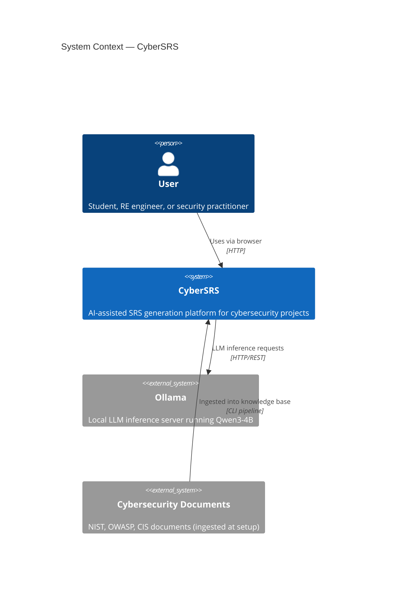
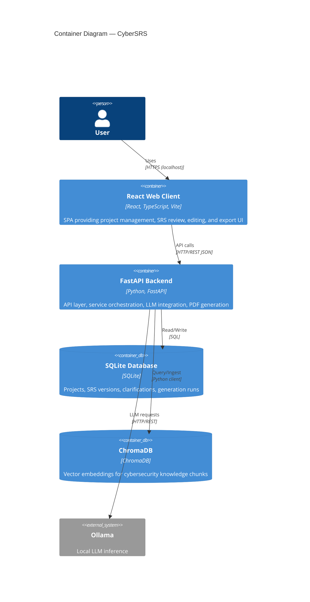
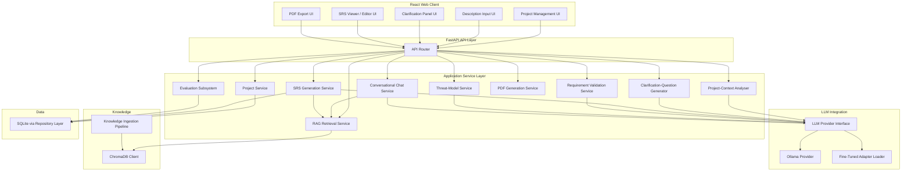
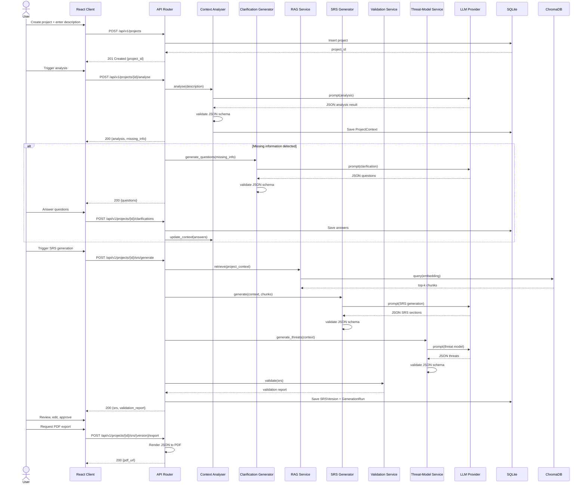
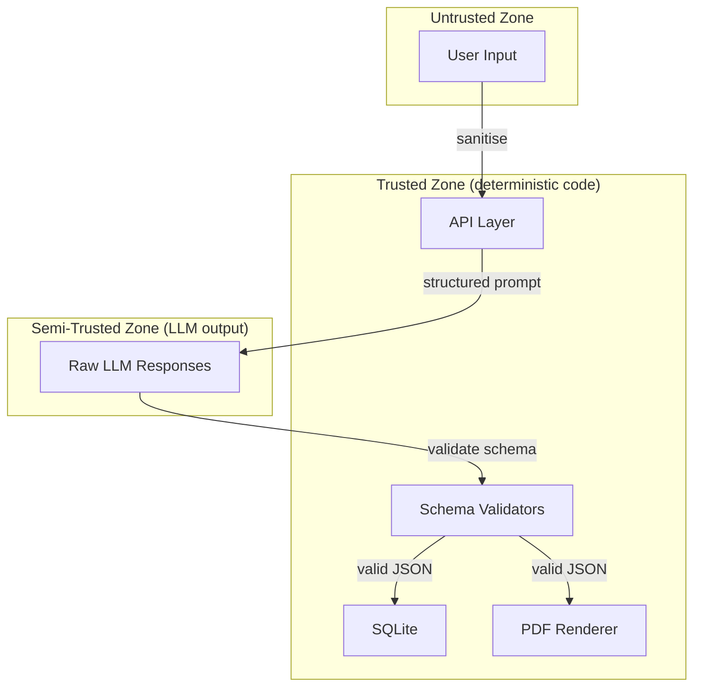

# System Architecture — CyberSRS

**Version:** 0.1.0-draft
**Date:** 2026-08-07
**Status:** Phase 0 — Planning

---

## 1. Architectural Style

CyberSRS is a **modular monolith** — a single deployable application with clearly separated internal service modules. This choice keeps deployment simple (single machine, one student developer) while maintaining separation of concerns for testability and future refactoring.

There are no microservices. All backend modules run in a single FastAPI process. The React frontend is a separate build artifact served statically or via Vite dev server.

---

## 2. System-Context Diagram

**Boundaries:**
- The user interacts with CyberSRS through a web browser on localhost.
- CyberSRS communicates only with the local Ollama instance — no other external services.
- Cybersecurity documents are ingested offline via a CLI pipeline.

---

## 3. Container-Level Diagram

---

## 4. Major-Component Diagram

The backend is organised into the following service modules:

### Component Descriptions

| Component | Responsibility | Type |
|---|---|---|
| **API Router** | HTTP request routing, input validation, response serialisation | Deterministic |
| **Project Service** | CRUD operations for projects and related entities | Deterministic |
| **Project-Context Analyser** | Calls the LLM to analyse descriptions, extract entities, infer subdomain | Generative |
| **Clarification-Question Generator** | Calls the LLM to produce clarification questions from detected gaps | Generative |
| **RAG Retrieval Service** | Constructs queries from project context, retrieves chunks from ChromaDB | Deterministic (retrieval) |
| **SRS Generation Service** | Orchestrates the generation of all SRS sections via the LLM with RAG context | Generative |
| **Requirement Validation Service** | Validates SRS for completeness, testability, consistency (mix of deterministic rules and LLM-assisted checks) | Hybrid |
| **Threat-Model Service** | Calls the LLM to generate threats and mitigations for the project | Generative |
| **PDF Generation Service** | Renders validated JSON into a PDF using templates | Deterministic |
| **Conversational Chat Service** | Classifies explicit workflow commands, retrieves local knowledge, and returns schema-validated answers with citations | Hybrid |
| **Task-Aware Provider Router** | Keeps general chat on the base Qwen model while routing requirements-engineering tasks to the configured base or fine-tuned variant | Deterministic |
| **Project Document Service** | Validates, stores, parses, chunks, indexes, lists, and deletes local project reference files | Deterministic |
| **Evaluation Subsystem** | Compares base-model and fine-tuned outputs on a reference dataset | Deterministic |
| **LLM Provider Interface** | Abstract interface for LLM calls; provider-independent | Deterministic |
| **Ollama Provider** | Concrete implementation of the LLM interface for Ollama | Deterministic |
| **Fine-Tuned Adapter Loader** | Loads QLoRA adapter weights; configures the provider to use them | Deterministic |
| **Knowledge Ingestion Pipeline** | CLI tool to chunk, embed, and store documents in ChromaDB | Deterministic |
| **ChromaDB Client** | Wrapper around ChromaDB operations (query, add, delete) | Deterministic |
| **SQLite Repository Layer** | Data-access layer for all SQLite operations | Deterministic |

General chat and SRS tasks use the same provider abstraction but separate configured instances. The general instance always selects the approved base Qwen model. The SRS instance selects `CYBERSRS_MODEL_VARIANT`, allowing a future QLoRA-derived Ollama model to improve analysis, clarification, generation, and editing without narrowing general chat.

Uploaded documents are stored under the configured local upload root using generated names. Their metadata and bounded extracted text are stored in SQLite, and their chunks are written to a separate ChromaDB collection with a mandatory `project_id` filter. They are never inserted into the global cybersecurity knowledge collection.

---

## 5. Main Data-Flow Sequence

### 5.1 SRS-Generation Sequence (Happy Path)

---

## 6. Failure Handling

### 6.1 LLM Failure

| Failure | Handling |
|---|---|
| Ollama unreachable | Retry up to `CYBERSRS_LLM_MAX_RETRIES` (default 3) with exponential backoff. If all retries fail, return HTTP 503 with a structured error. |
| Ollama returns HTTP error | Same retry logic. |
| LLM returns invalid JSON | Retry with a corrective prompt appending the schema and error. Up to `CYBERSRS_LLM_MAX_RETRIES`. If all fail, return HTTP 422 with details. |
| LLM returns empty response | Treat as invalid JSON — same retry path. |

### 6.2 RAG Failure

| Failure | Handling |
|---|---|
| ChromaDB unreachable | Log warning. Proceed with SRS generation without retrieved context. Include a warning in the API response. |
| ChromaDB returns zero results | Log info. Proceed without context. Include a notice in the response. |
| ChromaDB returns irrelevant results (low scores) | Filter chunks below a configurable `CYBERSRS_RAG_MIN_SCORE` threshold. If all chunks are below threshold, treat as zero results. |

### 6.3 PDF Generation Failure

| Failure | Handling |
|---|---|
| Template rendering error | Return HTTP 500 with details. User can retry. |
| File-system write error | Return HTTP 500 with details. Suggest checking disk space. |

### 6.4 Database Failure

| Failure | Handling |
|---|---|
| SQLite write error | Return HTTP 500. No partial writes (transactions). |
| SQLite read error | Return HTTP 500. |

---

## 7. Separation: Deterministic vs. LLM-Generated Logic

A critical architectural principle is that **deterministic logic and LLM-generated logic are clearly separated**:

| Layer | Deterministic | LLM-Generated |
|---|---|---|
| API routing, validation, serialisation | ✅ | ❌ |
| Database read/write | ✅ | ❌ |
| JSON-schema validation | ✅ | ❌ |
| PDF rendering | ✅ | ❌ |
| Requirement-ID assignment | ✅ | ❌ |
| RAG chunk retrieval and ranking | ✅ | ❌ |
| Description analysis | ❌ | ✅ |
| Clarification-question generation | ❌ | ✅ |
| SRS-section generation | ❌ | ✅ |
| Threat-model generation | ❌ | ✅ |
| Requirement-quality assessment | Partial (rules) | Partial (LLM-assisted) |

**Rule:** LLM output must always pass through a validation layer before being stored or returned. The validation layer is deterministic.

---

## 8. Trust Boundaries

- **User input** is untrusted. Sanitise before including in prompts.
- **LLM output** is semi-trusted. It has structure expectations but can produce invalid, inconsistent, or unsafe content. Always validate.
- **Deterministic code** (API layer, validators, database, PDF renderer) is trusted.

---

## 9. Logging Approach

| Level | What is logged | Sensitive data |
|---|---|---|
| `INFO` | Request method and path, response status, generation-run start/end, phase transitions | No |
| `WARNING` | RAG fallback, low-quality scores, retry attempts | No |
| `ERROR` | LLM failures, database errors, PDF errors, schema validation failures | No |
| `DEBUG` | Prompt templates (without user content), chunk IDs, model parameters | No (user content excluded) |

- Log format: structured JSON to stdout.
- Log level is configurable via `CYBERSRS_LOG_LEVEL` environment variable.
- In production mode, `DEBUG` is disabled to prevent accidental data exposure.
- No logging of full project descriptions, user answers, or generated SRS content.

---

## 10. Configuration Approach

All configuration is read from environment variables or a `.env` file. No hard-coded values.

| Variable | Purpose | Default |
|---|---|---|
| `CYBERSRS_OLLAMA_BASE_URL` | Ollama API base URL | `http://localhost:11434` |
| `CYBERSRS_MODEL_NAME` | Model identifier | `qwen3:4b` |
| `CYBERSRS_ADAPTER_PATH` | Path to QLoRA adapter (empty = base model) | `""` |
| `CYBERSRS_DB_PATH` | SQLite database file path | `./data/cybersrs.db` |
| `CYBERSRS_CHROMA_PATH` | ChromaDB persistence directory | `./data/chroma` |
| `CYBERSRS_PDF_OUTPUT_DIR` | Directory for exported PDFs | `./data/exports` |
| `CYBERSRS_LLM_MAX_RETRIES` | Max LLM retry attempts | `3` |
| `CYBERSRS_LLM_TIMEOUT_SECONDS` | Timeout per LLM call | `120` |
| `CYBERSRS_RAG_TOP_K` | Number of chunks to retrieve | `10` |
| `CYBERSRS_RAG_MIN_SCORE` | Minimum relevance score threshold | `0.3` |
| `CYBERSRS_RAG_CHUNK_SIZE` | Document chunk size (tokens) | `512` |
| `CYBERSRS_RAG_CHUNK_OVERLAP` | Chunk overlap (tokens) | `64` |
| `CYBERSRS_LOG_LEVEL` | Logging level | `INFO` |
| `CYBERSRS_FRONTEND_PORT` | Frontend dev server port | `5173` |
| `CYBERSRS_BACKEND_PORT` | Backend API port | `8000` |

---

## 11. Technology Constraints

| Constraint | Reason |
|---|---|
| No microservices | Simplicity; single developer; modular monolith is sufficient |
| No Docker requirement | Reduce setup friction; Docker is optional for convenience |
| No GPU requirement | Must work on CPU-only machines; GPU recommended |
| No external APIs | Local-first deployment principle |
| No real-time streaming in MVP | Simplicity; polling or progress indicators are sufficient |
| Single LLM only | Focus evaluation on one model; provider interface allows future expansion |
