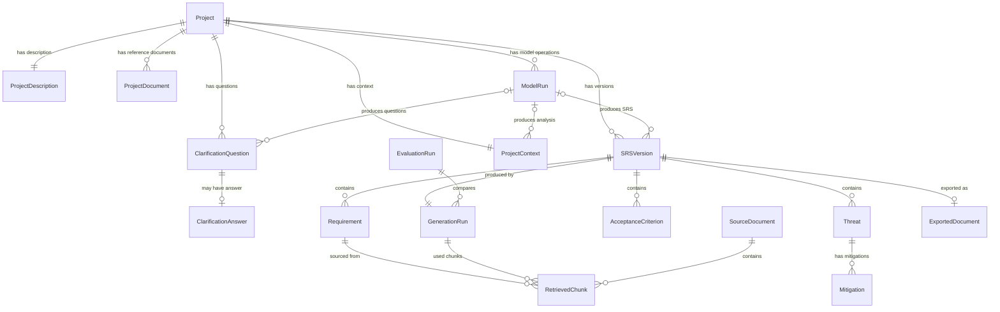

# Data Model — CyberSRS

**Version:** 0.1.0-draft
**Date:** 2026-08-07
**Status:** Phase 0 — Planning

---

## ChatSession and ChatMessage

`ChatSession` stores one resumable conversational workflow. It has an optional
`project_id`, display name, workflow stage, optional analysis/clarification/SRS
JSON snapshots, optional SRS-version link, pending project description, pin
timestamp, and created/updated UTC timestamps. `ChatMessage` stores ordered
user/assistant messages with message type, validated JSON metadata, and a UTC
timestamp. Deleting a session deletes its messages; deleting a project deletes
associated sessions. Sessions without a project remain valid general chats.

---

## 1. Entity-Relationship Overview



---

## 2. Entity Definitions

### 2.1 Project

**Purpose:** Root entity representing a user's cybersecurity project.

| Field | Type | Required | Description |
|---|---|---|---|
| `id` | UUID (string) | Yes | Primary key |
| `name` | string | Yes | User-provided project name |
| `status` | enum | Yes | `draft`, `analysed`, `clarifying`, `generating`, `generated`, `validated`, `exported` |
| `inferred_categories` | string[] | No | Inferred cybersecurity categories (CAT-01 through CAT-08) |
| `created_at` | datetime (UTC) | Yes | Creation timestamp |
| `updated_at` | datetime (UTC) | Yes | Last-modified timestamp |

**Validation rules:**
- `name` must be 1–200 characters.
- `status` must be one of the defined enum values.
- `created_at` and `updated_at` are set automatically.

**Sensitive-data considerations:** Project names may contain organisation names. Do not log in DEBUG.

**Relationships:** Has one `ProjectDescription`, zero or more `SRSVersion`, `ClarificationQuestion`, and `ProjectDocument` records, and one `ProjectContext`.

---

### 2.2 ProjectDescription

**Purpose:** Stores the user's informal project description.

| Field | Type | Required | Description |
|---|---|---|---|
| `id` | UUID (string) | Yes | Primary key |
| `project_id` | UUID (string) | Yes | Foreign key → Project |
| `raw_text` | text | Yes | The user's original description |
| `version` | integer | Yes | Incremented on update |
| `created_at` | datetime (UTC) | Yes | Creation timestamp |

**Validation rules:**
- `raw_text` must be at least 10 characters.
- `version` starts at 1 and auto-increments on update.

**Sensitive-data considerations:** May contain PII or organisational details. Do not log at DEBUG level.

---

### 2.3 ClarificationQuestion

**Purpose:** Stores a clarification question generated by the LLM.

| Field | Type | Required | Description |
|---|---|---|---|
| `id` | UUID (string) | Yes | Primary key |
| `project_id` | UUID (string) | Yes | Foreign key → Project |
| `question_text` | text | Yes | The question to ask the user |
| `reason` | text | Yes | Why this question is being asked |
| `is_critical` | boolean | Yes | Whether answering is required |
| `display_order` | integer | Yes | Order in which to show the question |
| `created_at` | datetime (UTC) | Yes | Creation timestamp |

**Validation rules:**
- `question_text` must not be empty.
- `display_order` must be ≥ 0.

**Relationships:** May have one `ClarificationAnswer`.

---

### 2.4 ClarificationAnswer

**Purpose:** Stores the user's answer to a clarification question.

| Field | Type | Required | Description |
|---|---|---|---|
| `id` | UUID (string) | Yes | Primary key |
| `question_id` | UUID (string) | Yes | Foreign key → ClarificationQuestion |
| `answer_text` | text | Yes | The user's answer |
| `skipped` | boolean | Yes | True if the user chose to skip |
| `created_at` | datetime (UTC) | Yes | Creation timestamp |

**Validation rules:**
- If `skipped` is false, `answer_text` must not be empty.
- If `skipped` is true, `answer_text` may be empty.

---

### 2.5 ProjectContext

**Purpose:** The enriched, structured representation of the project after analysis and clarification.

| Field | Type | Required | Description |
|---|---|---|---|
| `id` | UUID (string) | Yes | Primary key |
| `project_id` | UUID (string) | Yes | Foreign key → Project |
| `stakeholders` | JSON (string[]) | Yes | Extracted stakeholders |
| `assets` | JSON (string[]) | Yes | Extracted assets |
| `users` | JSON (string[]) | Yes | Extracted user roles |
| `constraints` | JSON (string[]) | Yes | Extracted constraints |
| `goals` | JSON (string[]) | Yes | Extracted goals |
| `inferred_categories` | JSON (string[]) | Yes | Inferred cybersecurity categories |
| `missing_information` | JSON (string[]) | No | Identified gaps |
| `enriched_context` | JSON (object) | No | Context after incorporating clarification answers |
| `created_at` | datetime (UTC) | Yes | Creation timestamp |
| `updated_at` | datetime (UTC) | Yes | Last-modified timestamp |

**Validation rules:**
- `stakeholders`, `assets`, `users`, `constraints`, `goals` must be non-empty arrays after analysis.
- `inferred_categories` must contain at least one value from CAT-01 through CAT-08.

**Sensitive-data considerations:** Contains distilled project information. Treat with same care as `ProjectDescription`.

---

### 2.6 SRSVersion

**Purpose:** A versioned snapshot of the generated SRS.

| Field | Type | Required | Description |
|---|---|---|---|
| `id` | UUID (string) | Yes | Primary key |
| `project_id` | UUID (string) | Yes | Foreign key → Project |
| `version_number` | integer | Yes | Sequential version number |
| `srs_json` | JSON (object) | Yes | The complete SRS in structured JSON (see Section 3) |
| `quality_score` | float | No | Overall quality score (0–100) |
| `status` | enum | Yes | `draft`, `validated`, `approved`, `exported` |
| `created_at` | datetime (UTC) | Yes | Creation timestamp |

**Validation rules:**
- `srs_json` must conform to the SRS JSON schema (Section 3).
- `version_number` starts at 1 and auto-increments.
- `quality_score` must be 0–100 if present.

**Relationships:** Contains many `Requirement`, `Threat`, `AcceptanceCriterion`. Produced by one `GenerationRun`. May have one `ExportedDocument`.

---

### 2.7 Requirement

**Purpose:** A single functional, non-functional, or security requirement within an SRS version.

| Field | Type | Required | Description |
|---|---|---|---|
| `id` | UUID (string) | Yes | Primary key (database) |
| `srs_version_id` | UUID (string) | Yes | Foreign key → SRSVersion |
| `requirement_id` | string | Yes | Human-readable ID (e.g., FR-001, SEC-003) |
| `category` | enum | Yes | `functional`, `non_functional`, `security` |
| `statement` | text | Yes | The requirement text |
| `priority` | enum | Yes | `must`, `should`, `could` |
| `rationale` | text | No | Why this requirement exists |
| `acceptance_criteria` | text | No | How to verify |
| `is_user_edited` | boolean | Yes | True if the user has modified this requirement |
| `sources` | JSON (string[]) | No | List of `RetrievedChunk` IDs that informed this requirement |

**Validation rules:**
- `requirement_id` must follow the pattern `[A-Z]{2,3}-\d{3}`.
- `statement` must not be empty and should begin with "The system shall" or equivalent testable language.
- `category` must be one of the enum values.

---

### 2.8 AcceptanceCriterion

**Purpose:** A specific acceptance criterion associated with the SRS.

| Field | Type | Required | Description |
|---|---|---|---|
| `id` | UUID (string) | Yes | Primary key |
| `srs_version_id` | UUID (string) | Yes | Foreign key → SRSVersion |
| `criterion_id` | string | Yes | Human-readable ID (e.g., AC-001) |
| `description` | text | Yes | The criterion text |
| `related_requirement_ids` | JSON (string[]) | No | Requirement IDs this criterion verifies |

**Validation rules:**
- `description` must not be empty.

---

### 2.9 Threat

**Purpose:** A threat identified in the threat model.

| Field | Type | Required | Description |
|---|---|---|---|
| `id` | UUID (string) | Yes | Primary key |
| `srs_version_id` | UUID (string) | Yes | Foreign key → SRSVersion |
| `threat_id` | string | Yes | Human-readable ID (e.g., THR-001) |
| `name` | string | Yes | Short threat name |
| `description` | text | Yes | Detailed threat description |
| `category` | string | No | STRIDE category or similar |
| `severity` | enum | Yes | `critical`, `high`, `medium`, `low` |
| `affected_assets` | JSON (string[]) | No | Assets at risk |

**Validation rules:**
- `severity` must be one of the enum values.
- `name` and `description` must not be empty.

**Relationships:** Has one or more `Mitigation`.

---

### 2.10 Mitigation

**Purpose:** A mitigation strategy for a specific threat.

| Field | Type | Required | Description |
|---|---|---|---|
| `id` | UUID (string) | Yes | Primary key |
| `threat_id` | UUID (string) | Yes | Foreign key → Threat |
| `mitigation_id` | string | Yes | Human-readable ID (e.g., MIT-001) |
| `description` | text | Yes | The mitigation strategy |
| `related_requirement_ids` | JSON (string[]) | No | Requirement IDs that implement this mitigation |

**Validation rules:**
- `description` must not be empty.

---

### 2.11 RetrievedChunk

**Purpose:** A chunk of text retrieved from the knowledge base via RAG.

| Field | Type | Required | Description |
|---|---|---|---|
| `id` | UUID (string) | Yes | Primary key |
| `source_document_id` | UUID (string) | Yes | Foreign key → SourceDocument |
| `chunk_index` | integer | Yes | Position of the chunk within the source document |
| `content` | text | Yes | The chunk text |
| `page_or_section` | string | No | Page number or section heading from the source |
| `relevance_score` | float | Yes | Cosine similarity or equivalent score |
| `embedding_vector` | blob | No | Stored in ChromaDB, not in SQLite |

**Validation rules:**
- `relevance_score` must be 0.0–1.0.
- `chunk_index` must be ≥ 0.

**Sensitive-data considerations:** Chunks contain publicly available cybersecurity knowledge — not user data.

---

### 2.12 SourceDocument

**Purpose:** A document ingested into the knowledge base.

| Field | Type | Required | Description |
|---|---|---|---|
| `id` | UUID (string) | Yes | Primary key |
| `title` | string | Yes | Document title |
| `author` | string | No | Author or organisation |
| `source_url` | string | No | URL where the document was obtained |
| `file_path` | string | Yes | Local file path of the original document |
| `document_type` | enum | Yes | `pdf`, `markdown`, `text` |
| `ingested_at` | datetime (UTC) | Yes | When the document was ingested |
| `chunk_count` | integer | Yes | Number of chunks created |

**Validation rules:**
- `title` must not be empty.
- `document_type` must be one of the enum values.
- `chunk_count` must be ≥ 1.

---

### 2.13 GenerationRun

**Purpose:** Records metadata about a single SRS-generation execution.

| Field | Type | Required | Description |
|---|---|---|---|
| `id` | UUID (string) | Yes | Primary key |
| `srs_version_id` | UUID (string) | Yes | Foreign key → SRSVersion |
| `model_name` | string | Yes | Model identifier used |
| `adapter_name` | string | No | Adapter identifier (if fine-tuned adapter was loaded) |
| `prompt_template_version` | string | Yes | Version of the prompt templates used |
| `retrieved_chunk_ids` | JSON (string[]) | No | Chunks used for this generation |
| `generation_time_seconds` | float | Yes | Total generation wall-clock time |
| `retry_count` | integer | Yes | Number of retries needed |
| `status` | enum | Yes | `success`, `partial_failure`, `failure` |
| `error_message` | text | No | Error details if status ≠ success |
| `created_at` | datetime (UTC) | Yes | Timestamp |

**Validation rules:**
- `generation_time_seconds` must be ≥ 0.
- `retry_count` must be ≥ 0.

---

### 2.14 EvaluationRun

**Purpose:** Records a comparative evaluation between base-model and fine-tuned outputs.

| Field | Type | Required | Description |
|---|---|---|---|
| `id` | UUID (string) | Yes | Primary key |
| `base_generation_run_id` | UUID (string) | Yes | Foreign key → GenerationRun (base model) |
| `finetuned_generation_run_id` | UUID (string) | Yes | Foreign key → GenerationRun (fine-tuned) |
| `metrics` | JSON (object) | Yes | Evaluation metrics (e.g., completeness_score, consistency_score, testability_score) |
| `evaluator_notes` | text | No | Human or automated evaluator notes |
| `created_at` | datetime (UTC) | Yes | Timestamp |

**Validation rules:**
- Both generation runs must exist.
- `metrics` must contain at least one numeric metric.

---

### 2.15 ExportedDocument

**Purpose:** Records a PDF export of an SRS version.

| Field | Type | Required | Description |
|---|---|---|---|
| `id` | UUID (string) | Yes | Primary key |
| `srs_version_id` | UUID (string) | Yes | Foreign key → SRSVersion |
| `file_path` | string | Yes | Local path to the generated PDF |
| `file_size_bytes` | integer | Yes | PDF file size |
| `exported_at` | datetime (UTC) | Yes | Export timestamp |

**Validation rules:**
- `file_path` must point to an existing file after export.
- `file_size_bytes` must be > 0.

---

### 2.16 ModelRun

**Purpose:** Lightweight experiment provenance for any model-backed operation,
including project analysis, clarification generation, SRS generation, and
future evaluation artifacts. This cross-operation entity complements the
older SRS-specific `GenerationRun` and does not store prompts or generated
artifact content.

| Field | Type | Required | Description |
|---|---|---|---|
| `id` | UUID (string) | Yes | Primary key |
| `project_id` | UUID (string) | No | Project scope; nullable for future system-level evaluation runs |
| `operation_type` | string | Yes | Controlled operation such as `project_analysis`, `clarification_generation`, or `srs_generation` |
| `model_variant` | string | Yes | `base`, `finetuned`, or `unknown` |
| `model_name` | string | Yes | Runtime model identifier |
| `rag_enabled` | boolean | Yes | Whether retrieval was actually used |
| `embedding_model` | string | No | Embedding model used for a RAG-enabled run |
| `knowledge_base_version` | string | No | Stable KB snapshot identifier |
| `retrieved_chunk_ids` | JSON (string[]) | No | Chroma chunk identifiers available to generation |
| `retrieved_document_ids` | JSON (string[]) | No | Source-document identifiers represented by retrieved chunks |
| `citation_ids` | JSON (string[]) | No | Retrieved chunk IDs retained as citations in the validated artifact |
| `started_at` | datetime (UTC) | Yes | Start time committed before inference |
| `completed_at` | datetime (UTC) | No | Success or failure completion time |
| `latency_seconds` | float | No | End-to-end model operation latency |
| `status` | string | Yes | `running`, `succeeded`, or `failed` |
| `error_message` | text | No | Sanitized failure class; no raw prompt, path, or secret |
| `metadata_json` | JSON (object) | No | Controlled prompt-version and deterministic validation/repair metadata |

`ProjectContext.model_run_id`, `ClarificationQuestion.model_run_id`,
`SRSVersion.model_run_id`, and `Phase5EvaluationRun.model_run_id` are nullable.
`NULL` means legacy/unknown provenance; the application never invents a model
or RAG configuration for an older artifact.

---

### 2.17 ProjectDocument

**Purpose:** Metadata and bounded extracted text for a locally uploaded reference file that belongs to exactly one project.

| Field | Type | Required | Description |
|---|---|---|---|
| `id` | UUID (string) | Yes | Generated primary key and Chroma source identifier |
| `project_id` | UUID (string) | Yes | Foreign key → Project with cascade deletion |
| `original_filename` | string | Yes | Sanitised display name; never used as the stored filename |
| `stored_path` | text | Yes | Generated local path under the configured upload root; never returned by the API |
| `media_type` | string | Yes | Server-approved media type |
| `file_extension` | string | Yes | Approved parser extension |
| `file_size_bytes` | integer | Yes | Uploaded byte count |
| `sha256` | string | Yes | Content-integrity digest |
| `status` | string | Yes | Processing status (`ready` for completed synchronous ingestion) |
| `extracted_text` | text | Yes | Locally parsed prompt context; never returned by the metadata API |
| `chunk_count` | integer | Yes | Number of chunks in the isolated project collection |
| `created_at` | datetime (UTC) | Yes | Upload timestamp |

Project-document chunks preserve `source_id`, `chunk_index`, page/section, relevance score, `project_id`, and `document_scope=project`. Retrieval from the project collection must always filter by `project_id`.

---

## 3. SRS JSON Schema

The `srs_json` field in `SRSVersion` stores the complete SRS as a JSON object. Below is the proposed structure:

```json
{
  "metadata": {
    "project_name": "string",
    "version": 1,
    "generated_at": "2026-01-01T00:00:00Z",
    "model_name": "string",
    "adapter_name": "string | null",
    "inferred_categories": ["string"]
  },
  "project_summary": {
    "description": "string",
    "stakeholders": ["string"],
    "assets": ["string"],
    "users": ["string"],
    "constraints": ["string"],
    "goals": ["string"]
  },
  "functional_requirements": [
    {
      "requirement_id": "FR-001",
      "statement": "The system shall...",
      "priority": "must",
      "rationale": "string",
      "acceptance_criteria": "string",
      "sources": ["chunk_id_1"]
    }
  ],
  "non_functional_requirements": [
    {
      "requirement_id": "NFR-001",
      "statement": "The system shall...",
      "priority": "must",
      "rationale": "string",
      "acceptance_criteria": "string",
      "sources": ["chunk_id_1"]
    }
  ],
  "security_requirements": [
    {
      "requirement_id": "SEC-001",
      "statement": "The system shall...",
      "priority": "must",
      "rationale": "string",
      "acceptance_criteria": "string",
      "threat_ids": ["THR-001"],
      "sources": ["chunk_id_1"]
    }
  ],
  "system_architecture": {
    "overview": "string",
    "components": [
      {
        "name": "string",
        "description": "string",
        "responsibilities": ["string"]
      }
    ],
    "data_flows": ["string"],
    "deployment_notes": "string"
  },
  "threat_model": {
    "methodology": "string",
    "threats": [
      {
        "threat_id": "THR-001",
        "name": "string",
        "description": "string",
        "category": "string",
        "severity": "high",
        "affected_assets": ["string"],
        "mitigations": [
          {
            "mitigation_id": "MIT-001",
            "description": "string",
            "related_requirement_ids": ["SEC-001"]
          }
        ]
      }
    ]
  },
  "acceptance_criteria": [
    {
      "criterion_id": "AC-001",
      "description": "string",
      "related_requirement_ids": ["FR-001"]
    }
  ],
  "testing_recommendations": [
    {
      "recommendation_id": "TEST-001",
      "description": "string",
      "type": "unit | integration | system | security | performance",
      "related_requirement_ids": ["FR-001"]
    }
  ],
  "references": [
    {
      "source_document_id": "string",
      "title": "string",
      "author": "string",
      "relevance": "string"
    }
  ],
  "validation_report": {
    "overall_score": 85,
    "issues": [
      {
        "issue_id": "VAL-001",
        "severity": "warning",
        "section": "functional_requirements",
        "requirement_id": "FR-003",
        "message": "string"
      }
    ]
  }
}
```

---

## 4. Storage Notes

| Data | Stored in |
|---|---|
| All relational entities (Project through ExportedDocument) | SQLite |
| Vector embeddings | ChromaDB |
| Chunk metadata (duplicate) | Both SQLite (for traceability) and ChromaDB (for retrieval) |
| Generated PDFs | Local file system (`CYBERSRS_PDF_OUTPUT_DIR`) |
| SRS JSON | SQLite (`srs_json` column in `SRSVersion`) |
