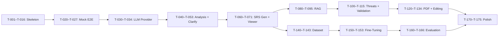

# Implementation Backlog — CyberSRS

**Version:** 0.1.0-draft
**Date:** 2026-08-07
**Status:** Phase 0 — Planning

> The first coding milestone produces a **working application using mocked AI output**. Fine-tuning and document ingestion come later.

---

## Epic Overview

| Epic | Phase | Summary |
|---|---|---|
| E1 | 1 | Non-AI Application Skeleton |
| E2 | 1 | Mock End-to-End Flow |
| E3 | 2 | LLM Provider Integration |
| E4 | 2 | Description Analysis Pipeline |
| E5 | 2 | Clarification Workflow |
| E6 | 3 | SRS Generation Pipeline |
| E7 | 3 | SRS Viewer UI |
| E8 | 4 | Knowledge Ingestion Pipeline |
| E9 | 4 | RAG Retrieval Integration |
| E10 | 5 | Threat-Model Generation |
| E11 | 5 | Requirement Validation |
| E12 | 6 | PDF Export |
| E13 | 6 | Editing and Regeneration |
| E14 | 7 | Dataset Preparation |
| E15 | 8 | QLoRA Fine-Tuning |
| E16 | 9 | Comparative Evaluation |
| E17 | 10 | Testing, Documentation, and Demo |

---

## Backlog Items

### Epic 1 — Non-AI Application Skeleton (Phase 1)

| Task ID | Description | Dependencies | Acceptance Criteria | Tests Required | Size | Order | Agent Role | Affected Files/Modules |
|---|---|---|---|---|---|---|---|---|
| T-001 | Set up Python project structure (src/, tests/, pyproject.toml or requirements.txt) | — | Project structure exists; `pip install` works. | — | S | 1 | Backend | `src/`, `pyproject.toml`, `requirements.txt` |
| T-002 | Set up React/TypeScript/Vite frontend scaffold | — | `npm install` and `npm run dev` work. | — | S | 2 | Frontend | `frontend/` |
| T-003 | Implement configuration loader (.env, environment variables, defaults) | T-001 | All `CYBERSRS_*` variables loaded with defaults. | Unit: config loading. | S | 3 | Backend | `src/config.py` |
| T-004 | Implement SQLite database layer with schema (all entities from DATA_MODEL.md) | T-003 | Schema created; tables match DATA_MODEL.md. | Unit: schema creation. DB: CRUD. | M | 4 | Backend | `src/database/`, `src/models/` |
| T-005 | Implement Project CRUD API endpoints (POST, GET, PUT, DELETE /projects) | T-004 | All endpoints respond correctly. | API: all CRUD operations. | M | 5 | Backend | `src/api/projects.py`, `src/services/project_service.py` |
| T-006 | Implement health-check endpoint (GET /health) | T-003 | Returns service status JSON. | API: health check. | S | 6 | Backend | `src/api/health.py` |
| T-007 | Implement input validation and error-response format | T-005 | 400/404 errors return structured JSON; body-size limit works. | API: error responses, oversized body. | S | 7 | Backend | `src/api/middleware.py` |
| T-008 | Implement path-traversal prevention utility | T-003 | Paths outside allowed directories are rejected. | Unit: path checker. | S | 8 | Backend | `src/utils/security.py` |
| T-009 | Implement log-redaction utility | T-003 | Sensitive text truncated with [REDACTED]. | Unit: redaction. | S | 9 | Backend | `src/utils/logging.py` |
| T-010 | Set up .gitignore (.env, *.db, node_modules, data/, __pycache__) | — | Files excluded from git. | Inspection. | S | 10 | Backend | `.gitignore` |
| T-011 | Set up .env.example with all CYBERSRS_* variables | T-003 | File exists with comments and placeholders. | Inspection. | S | 11 | Backend | `.env.example` |
| T-012 | Implement React project-list page | T-002, T-005 | Lists projects from API. | Frontend: project list renders. | M | 12 | Frontend | `frontend/src/pages/ProjectList.tsx` |
| T-013 | Implement React project-creation form | T-012 | Creates project via API. | Frontend: creation form. | S | 13 | Frontend | `frontend/src/pages/ProjectCreate.tsx` |
| T-014 | Implement React project-detail page | T-012 | Shows project metadata. | Frontend: detail renders. | M | 14 | Frontend | `frontend/src/pages/ProjectDetail.tsx` |
| T-015 | Set up pytest test structure mirroring src/ | T-001 | `pytest` runs and discovers tests. | — | S | 15 | Backend | `tests/` |
| T-016 | Implement LLMProvider abstract interface (no concrete provider) | T-001 | Abstract class with `generate()` method. | Inspection. | S | 16 | Backend | `src/llm/provider.py` |

### Epic 2 — Mock End-to-End Flow (Phase 1)

| Task ID | Description | Dependencies | Acceptance Criteria | Tests Required | Size | Order | Agent Role | Affected Files/Modules |
|---|---|---|---|---|---|---|---|---|
| T-020 | Implement MockLLMProvider returning hardcoded JSON responses | T-016 | Mock provider returns valid ProjectAnalysis, ClarificationQuestionSet, and SRS JSON. | Unit: mock provider. | M | 17 | Backend | `src/llm/mock_provider.py` |
| T-021 | Implement mock analysis endpoint using MockLLMProvider | T-020, T-005 | POST /projects/{id}/analyse returns mocked analysis. | API: analysis endpoint. | S | 18 | Backend | `src/api/analysis.py` |
| T-022 | Implement mock clarification endpoints | T-020, T-005 | GET/POST clarifications work with mocked questions. | API: clarification endpoints. | S | 19 | Backend | `src/api/clarifications.py` |
| T-023 | Implement mock SRS generation endpoint | T-020, T-005 | POST /projects/{id}/srs/generate returns mocked SRS. | API: SRS generation. | M | 20 | Backend | `src/api/srs.py`, `src/services/srs_service.py` |
| T-024 | Wire up React description-input UI | T-014, T-021 | User enters description, triggers analysis. | Frontend: description input. | M | 21 | Frontend | `frontend/src/pages/ProjectDetail.tsx` |
| T-025 | Wire up React clarification panel | T-024, T-022 | Shows mocked questions, accepts answers. | Frontend: clarification panel. | M | 22 | Frontend | `frontend/src/components/ClarificationPanel.tsx` |
| T-026 | Wire up React SRS viewer (section-by-section display) | T-023 | Displays mocked SRS in navigable view. | Frontend: SRS viewer. | M | 23 | Frontend | `frontend/src/components/SRSViewer.tsx` |
| T-027 | Run end-to-end test with mocked LLM | T-026 | Create → analyse → clarify → generate → view all work. | E2E: mocked full workflow. | M | 24 | Full-stack | — |

### Epic 3 — LLM Provider Integration (Phase 2)

| Task ID | Description | Dependencies | Acceptance Criteria | Tests Required | Size | Order | Agent Role | Affected Files/Modules |
|---|---|---|---|---|---|---|---|---|
| T-030 | Implement OllamaProvider (concrete LLMProvider) | T-016 | Calls Ollama API; returns response. | Unit: Ollama provider (mocked HTTP). | M | 25 | Backend | `src/llm/ollama_provider.py` |
| T-031 | Implement retry logic with corrective prompts | T-030 | Retries on invalid JSON; appends error context. | Unit: retry logic. Invalid output: all scenarios. | M | 26 | Backend | `src/llm/retry.py` |
| T-032 | Implement input sanitisation function | T-030 | Strips HTML, shell metacharacters from user text. | Unit: sanitisation. | S | 27 | Backend | `src/utils/sanitisation.py` |
| T-033 | Implement model-name verification (SEC-035) | T-030 | Verifies Ollama model matches config. | Unit: model verification. | S | 28 | Backend | `src/llm/ollama_provider.py` |
| T-034 | Implement LLM timeout handling | T-030 | Calls timeout after configured seconds. | Timeout: all scenarios. | S | 29 | Backend | `src/llm/ollama_provider.py` |

### Epic 4 — Description Analysis Pipeline (Phase 2)

| Task ID | Description | Dependencies | Acceptance Criteria | Tests Required | Size | Order | Agent Role | Affected Files/Modules |
|---|---|---|---|---|---|---|---|---|
| T-040 | Define Pydantic models for ProjectAnalysis | T-001 | Models validate valid/invalid samples. | Schema: ProjectAnalysis. | S | 30 | Backend | `src/schemas/analysis.py` |
| T-041 | Implement analysis prompt template | T-040 | Template produces correct prompt structure. | Inspection. | M | 31 | Backend | `src/prompts/analysis.py` |
| T-042 | Implement Project-Context Analyser service | T-041, T-030 | Calls LLM, validates, stores ProjectContext. | Prompt-output: analysis. | M | 32 | Backend | `src/services/analysis_service.py` |
| T-043 | Replace mock analysis endpoint with real LLM | T-042 | POST /analyse uses OllamaProvider. | API: analysis (real LLM, manual). | S | 33 | Backend | `src/api/analysis.py` |

### Epic 5 — Clarification Workflow (Phase 2)

| Task ID | Description | Dependencies | Acceptance Criteria | Tests Required | Size | Order | Agent Role | Affected Files/Modules |
|---|---|---|---|---|---|---|---|---|
| T-050 | Define Pydantic models for ClarificationQuestionSet | T-001 | Models validate valid/invalid samples. | Schema: ClarificationQuestionSet. | S | 34 | Backend | `src/schemas/clarification.py` |
| T-051 | Implement clarification prompt template | T-050 | Template produces correct prompt. | Inspection. | M | 35 | Backend | `src/prompts/clarification.py` |
| T-052 | Implement Clarification-Question Generator service | T-051, T-030 | Calls LLM, validates, stores questions. | Prompt-output: clarification. | M | 36 | Backend | `src/services/clarification_service.py` |
| T-053 | Replace mock clarification endpoints with real LLM | T-052 | Endpoints use real LLM. | API: clarification (mocked LLM). | S | 37 | Backend | `src/api/clarifications.py` |

### Epic 6 — SRS Generation Pipeline (Phase 3)

| Task ID | Description | Dependencies | Acceptance Criteria | Tests Required | Size | Order | Agent Role | Affected Files/Modules |
|---|---|---|---|---|---|---|---|---|
| T-060 | Define Pydantic models for all SRS sections | T-040 | Models validate all sections. | Schema: all SRS sections. | M | 38 | Backend | `src/schemas/srs.py` |
| T-061 | Implement SRS prompt templates (per section) | T-060 | Separate templates for FR, NFR, SEC, ARCH, AC, TEST. | Inspection. | L | 39 | Backend | `src/prompts/srs_*.py` |
| T-062 | Implement requirement-ID generator | T-060 | Unique, correctly formatted IDs. | Unit: ID generator. | S | 40 | Backend | `src/utils/id_generator.py` |
| T-063 | Implement SRS Generation Service (orchestrator) | T-061, T-062, T-030 | Generates all sections, assembles full SRS JSON. | Prompt-output: SRS sections. | L | 41 | Backend | `src/services/srs_generation_service.py` |
| T-064 | Implement GenerationRun metadata recording | T-063 | GenerationRun records saved with all metadata. | DB: generation-run creation. | S | 42 | Backend | `src/services/srs_generation_service.py` |
| T-065 | Implement generation-run status endpoint | T-064 | GET /generation-runs/{id} returns status. | API: status endpoint. | S | 43 | Backend | `src/api/generation_runs.py` |
| T-066 | Implement SRS retrieval endpoints (latest, version list) | T-063 | GET /srs and GET /srs/versions work. | API: SRS retrieval. | S | 44 | Backend | `src/api/srs.py` |
| T-067 | Implement progress indicators in React | T-065 | Spinner/progress visible during generation. | Frontend: progress indicators. | M | 45 | Frontend | `frontend/src/components/ProgressIndicator.tsx` |

### Epic 7 — SRS Viewer UI (Phase 3)

| Task ID | Description | Dependencies | Acceptance Criteria | Tests Required | Size | Order | Agent Role | Affected Files/Modules |
|---|---|---|---|---|---|---|---|---|
| T-070 | Implement section-by-section SRS display | T-066 | All SRS sections visible and navigable. | Frontend: SRS viewer. | M | 46 | Frontend | `frontend/src/components/SRSViewer.tsx` |
| T-071 | Implement section navigation (sidebar or tabs) | T-070 | User can jump to any section. | Frontend: navigation. | M | 47 | Frontend | `frontend/src/components/SectionNav.tsx` |

### Epic 8 — Knowledge Ingestion Pipeline (Phase 4)

| Task ID | Description | Dependencies | Acceptance Criteria | Tests Required | Size | Order | Agent Role | Affected Files/Modules |
|---|---|---|---|---|---|---|---|---|
| T-080 | Implement document parser (PDF, Markdown, text) | T-001 | Extracts text with section headings and page numbers. | Ingestion: parsing. | L | 48 | Backend | `src/rag/parser.py` |
| T-081 | Implement section-aware chunker | T-080 | Produces chunks within size limits; respects boundaries. | Ingestion: chunking. | M | 49 | Backend | `src/rag/chunker.py` |
| T-082 | Implement chunk-metadata builder | T-081 | All required metadata fields populated. | Unit: metadata builder. | S | 50 | Backend | `src/rag/metadata.py` |
| T-083 | Select and integrate embedding model (resolve UDEC-001) | T-082 | Embedding model produces vectors. | Unit: embedding. | M | 51 | Backend | `src/rag/embedder.py` |
| T-084 | Implement ChromaDB storage (add, query, delete) | T-083 | Chunks stored and queryable. | Ingestion: storage, dedup. | M | 52 | Backend | `src/rag/chroma_client.py` |
| T-085 | Implement source manifest and file hashing | T-084 | Manifest tracks all ingested documents with SHA-256. | Ingestion: hash, manifest. | S | 53 | Backend | `src/rag/manifest.py` |
| T-086 | Implement ingestion CLI tool | T-085 | CLI ingests a document into ChromaDB. | Ingestion: full pipeline. | M | 54 | Backend | `src/cli/ingest.py` |
| T-087 | Seed knowledge base with ≥ 5 documents | T-086 | ChromaDB contains chunks from ≥ 5 sources. | Manual: query test. | M | 55 | Backend | `data/knowledge/` |
| T-088 | Implement file-type and MIME validation (SEC-013, SEC-014) | T-086 | Rejects non-PDF/MD/TXT files. | Ingestion: file-type rejection. | S | 56 | Backend | `src/rag/parser.py` |

### Epic 9 — RAG Retrieval Integration (Phase 4)

| Task ID | Description | Dependencies | Acceptance Criteria | Tests Required | Size | Order | Agent Role | Affected Files/Modules |
|---|---|---|---|---|---|---|---|---|
| T-090 | Implement RAG Retrieval Service (query, filter, assemble) | T-084 | Returns filtered, ranked chunks. | Retrieval: query, filtering, dedup. | M | 57 | Backend | `src/services/rag_service.py` |
| T-091 | Integrate RAG into SRS Generation Service | T-090, T-063 | SRS generation uses retrieved chunks. | Citation: propagation. | M | 58 | Backend | `src/services/srs_generation_service.py` |
| T-092 | Implement source-references API endpoint | T-091 | GET /srs/{vid}/sources returns chunk references. | API: source references. | S | 59 | Backend | `src/api/srs.py` |
| T-093 | Implement source-reference display in React | T-092 | Citations visible next to requirements. | Frontend: source references. | M | 60 | Frontend | `frontend/src/components/SourceReferences.tsx` |
| T-094 | Implement RAG fallback (generate without context) | T-091 | SRS generated with warning when ChromaDB is empty/down. | Vector-store failure: all. | S | 61 | Backend | `src/services/rag_service.py` |
| T-095 | Implement citation validation (SEC-038) | T-091 | Hallucinated citations flagged. | Citation: hallucinated, valid. | S | 62 | Backend | `src/services/validation_service.py` |

### Epic 10 — Threat-Model Generation (Phase 5)

| Task ID | Description | Dependencies | Acceptance Criteria | Tests Required | Size | Order | Agent Role | Affected Files/Modules |
|---|---|---|---|---|---|---|---|---|
| T-100 | Define Pydantic models for ThreatModel | T-060 | Valid/invalid samples pass/fail. | Schema: ThreatModel. | S | 63 | Backend | `src/schemas/threat.py` |
| T-101 | Implement threat-model prompt template | T-100 | Template produces STRIDE-based output. | Inspection. | M | 64 | Backend | `src/prompts/threat.py` |
| T-102 | Implement Threat-Model Service | T-101, T-030 | Generates threats with mitigations. | Prompt-output: threat model. | M | 65 | Backend | `src/services/threat_service.py` |
| T-103 | Integrate threat model into SRS pipeline | T-102 | Threat model appears in generated SRS. | E2E: SRS with threats. | S | 66 | Backend | `src/services/srs_generation_service.py` |

### Epic 11 — Requirement Validation (Phase 5)

| Task ID | Description | Dependencies | Acceptance Criteria | Tests Required | Size | Order | Agent Role | Affected Files/Modules |
|---|---|---|---|---|---|---|---|---|
| T-110 | Implement deterministic validation checks (completeness, ID format) | T-063 | Missing sections flagged; invalid IDs flagged. | Unit: validation rules. | M | 67 | Backend | `src/services/validation_service.py` |
| T-111 | Implement LLM-assisted validation (testability, ambiguity) | T-110, T-030 | Validation report includes quality assessments. | Prompt-output: validation. | M | 68 | Backend | `src/services/validation_service.py` |
| T-112 | Implement quality-score calculation | T-110 | Score 0–100 computed. | Unit: quality score. | S | 69 | Backend | `src/services/validation_service.py` |
| T-113 | Implement validation API endpoint | T-112 | POST /srs/{vid}/validate returns report. | API: validation. | S | 70 | Backend | `src/api/srs.py` |
| T-114 | Implement inline validation warnings in React | T-113 | Issues shown next to requirements. | Frontend: validation warnings. | M | 71 | Frontend | `frontend/src/components/ValidationWarnings.tsx` |
| T-115 | Implement exploit-pattern scanning (SEC-025) | T-110 | Generated security requirements scanned. | Security: prompt injection. | S | 72 | Backend | `src/services/validation_service.py` |

### Epic 12 — PDF Export (Phase 6)

| Task ID | Description | Dependencies | Acceptance Criteria | Tests Required | Size | Order | Agent Role | Affected Files/Modules |
|---|---|---|---|---|---|---|---|---|
| T-120 | Select PDF library (resolve UDEC-002) | — | Library chosen and tested with sample data. | Manual: sample PDF. | S | 73 | Backend | — |
| T-121 | Implement PDF template (title, TOC, sections, footer) | T-120 | Professional-looking PDF generated from sample JSON. | PDF: contains all sections. | L | 74 | Backend | `src/pdf/template.py` |
| T-122 | Implement PDF text escaping (SEC-045) | T-121 | Special characters render correctly. | PDF: escaping. | S | 75 | Backend | `src/pdf/escaper.py` |
| T-123 | Implement traceability matrix generation | T-121 | Matrix links requirements to threats and ACs. | PDF: matrix present. | M | 76 | Backend | `src/pdf/traceability.py` |
| T-124 | Implement export API endpoints | T-121 | POST /export and GET /download work. | API: export, download. | M | 77 | Backend | `src/api/exports.py` |
| T-125 | Implement PDF download in React | T-124 | File downloads on click. | Frontend: PDF download. | S | 78 | Frontend | `frontend/src/components/ExportButton.tsx` |

### Epic 13 — Editing and Regeneration (Phase 6)

| Task ID | Description | Dependencies | Acceptance Criteria | Tests Required | Size | Order | Agent Role | Affected Files/Modules |
|---|---|---|---|---|---|---|---|---|
| T-130 | Implement inline editing UI | T-070 | User can edit requirements in place. | Frontend: inline editing. | M | 79 | Frontend | `frontend/src/components/InlineEditor.tsx` |
| T-131 | Implement SRS update API endpoint | T-063 | PUT /srs/{vid} saves user edits. | API: SRS update. | M | 80 | Backend | `src/api/srs.py` |
| T-132 | Implement section-regeneration API endpoint | T-063 | POST /srs/{vid}/regenerate regenerates selected section. | API: regeneration. | M | 81 | Backend | `src/api/srs.py` |
| T-133 | Implement SRS version history display | T-066 | UI shows version list. | Frontend: version list. | S | 82 | Frontend | `frontend/src/components/VersionHistory.tsx` |
| T-134 | Implement concurrent-run limit (SEC-040) | T-063 | Second generation returns 429. | API: concurrent limit. | S | 83 | Backend | `src/api/middleware.py` |

### Epic 14 — Dataset Preparation (Phase 7)

| Task ID | Description | Dependencies | Acceptance Criteria | Tests Required | Size | Order | Agent Role | Affected Files/Modules |
|---|---|---|---|---|---|---|---|---|
| T-140 | Author/collect training examples (all categories) | T-060 | ≥ 390 examples across 13 categories. | Schema validation on all. | L | 84 | Student | `data/datasets/` |
| T-141 | Implement dataset preparation script (format, validate, split) | T-140 | Script processes JSONL, validates schemas, splits. | Unit: dataset script. | M | 85 | Backend | `scripts/prepare_dataset.py` |
| T-142 | Implement leakage-prevention check | T-141 | No test examples in training set. | Unit: leakage check. | S | 86 | Backend | `scripts/prepare_dataset.py` |
| T-143 | Create dataset card documentation | T-141 | Card describes size, categories, provenance. | Inspection. | S | 87 | Student | `data/datasets/DATASET_CARD.md` |

### Epic 15 — QLoRA Fine-Tuning (Phase 8)

| Task ID | Description | Dependencies | Acceptance Criteria | Tests Required | Size | Order | Agent Role | Affected Files/Modules |
|---|---|---|---|---|---|---|---|---|
| T-150 | Implement QLoRA training script | T-141 | Script runs one training step without error. | Fine-tuning smoke: training starts. | L | 88 | Backend | `scripts/train.py` |
| T-151 | Run training and save adapter | T-150 | Adapter files saved with hash. | Fine-tuning smoke: checkpoint, adapter. | L | 89 | Student | `data/adapters/` |
| T-152 | Implement adapter-loading in the application | T-151 | App can switch between base and fine-tuned. | Fine-tuning smoke: adapter loading, hash. | M | 90 | Backend | `src/llm/adapter_loader.py` |
| T-153 | Document training configuration | T-151 | Config, hyperparameters, results logged. | Inspection. | S | 91 | Student | `data/adapters/training_report.md` |

### Epic 16 — Comparative Evaluation (Phase 9)

| Task ID | Description | Dependencies | Acceptance Criteria | Tests Required | Size | Order | Agent Role | Affected Files/Modules |
|---|---|---|---|---|---|---|---|---|
| T-160 | Implement evaluation script (automated + rule-based metrics) | T-063 | Script computes all automated metrics. | Evaluation: reproducibility. | L | 92 | Backend | `scripts/evaluate.py` |
| T-161 | Run C1 baseline evaluation | T-160 | Baseline metrics recorded. | Evaluation: results populated. | M | 93 | Student | — |
| T-162 | Run C2 evaluation (base + RAG) | T-160, T-091 | C2 metrics recorded. | Evaluation: results populated. | M | 94 | Student | — |
| T-163 | Run C3 evaluation (fine-tuned, no RAG) | T-152 | C3 metrics recorded. | Evaluation: results populated. | M | 95 | Student | — |
| T-164 | Run C4 evaluation (fine-tuned + RAG) | T-152, T-091 | C4 metrics recorded. | Evaluation: results populated. | M | 96 | Student | — |
| T-165 | Conduct human rubric evaluation (subset) | T-164 | Human scores for ≥ 10 examples across configs. | — | M | 97 | Student | — |
| T-166 | Write comparison report | T-165 | Report with all table templates filled. | Inspection. | M | 98 | Student | `docs/EVALUATION_RESULTS.md` |

### Epic 17 — Testing, Documentation, and Demo (Phase 10)

| Task ID | Description | Dependencies | Acceptance Criteria | Tests Required | Size | Order | Agent Role | Affected Files/Modules |
|---|---|---|---|---|---|---|---|---|
| T-170 | Run full test suite, fix remaining bugs | All prior | All tests pass. | All tests. | L | 99 | Full-stack | — |
| T-171 | End-to-end test on 3 demo projects (real LLM) | T-170 | All 3 demos succeed. | E2E: 3 demo projects. | M | 100 | Student | — |
| T-172 | Update README with real installation and usage instructions | T-170 | README is accurate and usable. | Manual: follow instructions on clean machine. | S | 101 | Student | `README.md` |
| T-173 | Update all planning documents for accuracy | T-170 | Docs reflect actual implementation. | Inspection. | M | 102 | Student | `docs/` |
| T-174 | Prepare demo script and backup offline demo | T-171 | Demo procedure documented; offline fallback works. | Manual: run offline demo. | M | 103 | Student | `docs/DEMO_PLAN.md`, `data/demo/` |
| T-175 | Tag release version | T-174 | Git tag exists. | — | S | 104 | Student | — |

---

## Implementation Order Summary

---

## Task Count Summary

| Size | Count |
|---|---|
| Small (S) | 32 |
| Medium (M) | 37 |
| Large (L) | 8 |
| **Total** | **77** |
