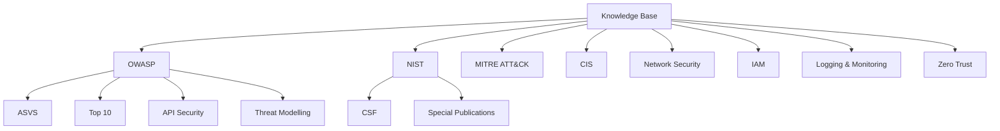

# Knowledge Base Plan — CyberSRS

**Version:** 0.1.0-draft
**Date:** 2026-08-07
**Status:** Phase 0 — Planning

> This document plans the initial knowledge corpus for RAG retrieval. No documents have been downloaded or ingested yet.

---

## 1. Corpus Organisation

Knowledge sources are organised by category. Each category serves a distinct purpose in SRS generation.

---

## 2. Planned Source Categories

### 2.1 OWASP Application Security Verification Standard (ASVS)

| Attribute | Value |
|---|---|
| **Purpose** | Provides detailed, testable security requirements for web applications and APIs. Directly maps to generated security requirements (CAT-05). |
| **Expected contribution** | Security requirements templates, verification levels, control categories, acceptance criteria language. |
| **Preferred format** | Markdown or PDF |
| **Versioning strategy** | Track the major version (e.g., ASVS 4.0). Update when a new major version is released. |
| **Metadata requirements** | Title, version, chapter/section heading, publication date, OWASP as organisation. |
| **Inclusion criteria** | Chapters covering authentication, session management, access control, input validation, cryptography, error handling, API security. |
| **Exclusion criteria** | Chapters focused on mobile-specific controls (out of scope for MVP). |
| **Update strategy** | Monitor OWASP releases; re-ingest when a new version is published. |

### 2.2 OWASP Top 10

| Attribute | Value |
|---|---|
| **Purpose** | Identifies the most critical web application security risks. Informs threat-model generation and security requirements. |
| **Expected contribution** | Threat descriptions, risk ratings, prevention checklists, example attack scenarios. |
| **Preferred format** | Markdown or PDF |
| **Versioning strategy** | Track the edition year (e.g., 2021). |
| **Metadata requirements** | Title, edition, risk category (A01–A10), OWASP as organisation. |
| **Inclusion criteria** | All 10 risk categories with descriptions and prevention guidance. |
| **Exclusion criteria** | Community-submitted supplementary content with unverified quality. |
| **Update strategy** | Update when a new edition is released (typically every 3–4 years). |

### 2.3 OWASP API Security Top 10

| Attribute | Value |
|---|---|
| **Purpose** | Specific API security risks for projects in category CAT-05 (Secure web applications and APIs). |
| **Expected contribution** | API-specific threat descriptions, prevention guidance, security requirement templates. |
| **Preferred format** | Markdown or PDF |
| **Versioning strategy** | Track the edition year. |
| **Metadata requirements** | Title, edition, risk category, OWASP as organisation. |
| **Inclusion criteria** | All API-specific risk categories. |
| **Exclusion criteria** | Duplicative content already covered by the general OWASP Top 10. |
| **Update strategy** | Update when a new edition is released. |

### 2.4 OWASP Threat Modelling Guidance

| Attribute | Value |
|---|---|
| **Purpose** | Informs the threat-model generation service with methodology and process guidance. |
| **Expected contribution** | STRIDE methodology descriptions, threat categorisation, data-flow-diagram guidance, mitigation patterns. |
| **Preferred format** | Markdown or PDF |
| **Versioning strategy** | Track document version. |
| **Metadata requirements** | Title, version, section heading, OWASP as organisation. |
| **Inclusion criteria** | Methodology descriptions, examples, templates. |
| **Exclusion criteria** | Tool-specific guides (e.g., Microsoft Threat Modeling Tool tutorials). |
| **Update strategy** | Re-ingest when content is substantially updated. |

### 2.5 NIST Cybersecurity Framework (CSF)

| Attribute | Value |
|---|---|
| **Purpose** | Provides a high-level framework (Identify, Protect, Detect, Respond, Recover) for organising cybersecurity requirements. |
| **Expected contribution** | Framework categories and subcategories, informative references, implementation examples. |
| **Preferred format** | PDF |
| **Versioning strategy** | Track the version (e.g., CSF 2.0). |
| **Metadata requirements** | Title, version, function/category/subcategory, NIST as organisation. |
| **Inclusion criteria** | Core framework document, implementation examples. |
| **Exclusion criteria** | Sector-specific profiles (e.g., healthcare, manufacturing). |
| **Update strategy** | Update when a new version is published. |

### 2.6 Relevant NIST Special Publications

| Attribute | Value |
|---|---|
| **Purpose** | Detailed technical guidance for specific cybersecurity domains. |
| **Expected contribution** | Firewall policy (SP 800-41), IDS/IPS guidance (SP 800-94), IAM (SP 800-63), logging (SP 800-92), network security (SP 800-77), zero trust (SP 800-207), VPN (SP 800-77 Rev 1). |
| **Preferred format** | PDF |
| **Versioning strategy** | Track the SP number and revision. |
| **Metadata requirements** | SP number, title, revision, section heading, page number, NIST as organisation. |
| **Inclusion criteria** | SPs directly relevant to the 8 supported project categories. Priority SPs: 800-41, 800-53, 800-63, 800-77, 800-92, 800-94, 800-207. |
| **Exclusion criteria** | SPs focused on domains not in the MVP (e.g., IoT, cloud-native, quantum). |
| **Update strategy** | Monitor NIST for revisions; re-ingest updated SPs. |

### 2.7 MITRE ATT&CK Techniques and Mitigations

| Attribute | Value |
|---|---|
| **Purpose** | Provides a comprehensive catalogue of adversary tactics, techniques, and mitigations for threat-model generation. |
| **Expected contribution** | Technique descriptions, mitigation descriptions, tactic-to-technique mappings. |
| **Preferred format** | Markdown or structured text (exported from ATT&CK Navigator or STIX data) |
| **Versioning strategy** | Track the ATT&CK version (e.g., v15). |
| **Metadata requirements** | Technique ID (e.g., T1190), tactic, technique name, MITRE as organisation. |
| **Inclusion criteria** | Enterprise ATT&CK techniques relevant to network security, IAM, web applications. Corresponding mitigations (M-series IDs). |
| **Exclusion criteria** | Mobile and ICS ATT&CK matrices. Techniques irrelevant to the 8 categories. |
| **Update strategy** | ATT&CK updates quarterly; re-ingest relevant techniques when major changes occur. |

### 2.8 CIS Controls

| Attribute | Value |
|---|---|
| **Purpose** | Prioritised set of security controls for network and infrastructure defence. Maps to implementation-ready security requirements. |
| **Expected contribution** | Control descriptions, implementation groups, safeguard descriptions. |
| **Preferred format** | PDF or structured text |
| **Versioning strategy** | Track the version (e.g., CIS Controls v8.1). |
| **Metadata requirements** | Control number, safeguard number, implementation group, CIS as organisation. |
| **Inclusion criteria** | All 18 control families; focus on Implementation Groups 1 and 2. |
| **Exclusion criteria** | Vendor-specific CIS Benchmarks (e.g., CIS Benchmark for Apache). |
| **Update strategy** | Update when a new version is released. |

### 2.9 Network Security Guidance

| Attribute | Value |
|---|---|
| **Purpose** | Technical guidance for firewall configuration, network segmentation, traffic analysis. Supports CAT-01, CAT-02, CAT-08. |
| **Expected contribution** | Network architecture patterns, firewall rule design, segmentation strategies. |
| **Preferred format** | PDF or Markdown |
| **Versioning strategy** | Track per document. |
| **Metadata requirements** | Title, version, section, publisher. |
| **Inclusion criteria** | Authoritative publications from NIST, SANS, or industry consortia. |
| **Exclusion criteria** | Vendor marketing material; product-specific configuration guides. |
| **Update strategy** | Ad hoc; replace when better sources are found. |

### 2.10 Identity and Access Management Guidance

| Attribute | Value |
|---|---|
| **Purpose** | Authentication, authorisation, SSO, MFA, RBAC guidance. Supports CAT-04. |
| **Expected contribution** | IAM architecture patterns, authentication requirements, access-control models. |
| **Preferred format** | PDF |
| **Versioning strategy** | Track per document. |
| **Metadata requirements** | Title, version, section, publisher. |
| **Inclusion criteria** | NIST SP 800-63 (Digital Identity Guidelines), OWASP authentication guidance. |
| **Exclusion criteria** | Vendor-specific IAM product documentation. |
| **Update strategy** | Update when NIST revises SP 800-63. |

### 2.11 Logging and Monitoring Guidance

| Attribute | Value |
|---|---|
| **Purpose** | Security logging, SIEM concepts, alerting patterns. Supports CAT-07. |
| **Expected contribution** | What to log, log formats, alert thresholds, monitoring architecture. |
| **Preferred format** | PDF |
| **Versioning strategy** | Track per document. |
| **Metadata requirements** | Title, version, section, publisher. |
| **Inclusion criteria** | NIST SP 800-92, CIS Controls (Control 8), OWASP logging guidance. |
| **Exclusion criteria** | Vendor-specific SIEM product documentation. |
| **Update strategy** | Ad hoc. |

### 2.12 Zero Trust Guidance

| Attribute | Value |
|---|---|
| **Purpose** | Zero-trust architecture principles and implementation guidance. Supports CAT-08. |
| **Expected contribution** | Zero-trust architecture components, policy enforcement points, micro-segmentation patterns. |
| **Preferred format** | PDF |
| **Versioning strategy** | Track per document. |
| **Metadata requirements** | Title, version, section, publisher. |
| **Inclusion criteria** | NIST SP 800-207 (Zero Trust Architecture). |
| **Exclusion criteria** | Vendor-specific zero-trust product marketing. |
| **Update strategy** | Update when NIST revises SP 800-207. |

---

## 3. Estimated Corpus Size

| Category | Estimated Documents | Estimated Chunks (at 512 tokens) |
|---|---|---|
| OWASP (ASVS, Top 10, API, TM) | 4–6 | 200–400 |
| NIST CSF | 1 | 50–100 |
| NIST Special Publications | 5–7 | 500–1000 |
| MITRE ATT&CK (selected) | 1–2 (exported) | 300–600 |
| CIS Controls | 1 | 100–200 |
| Network / IAM / Logging / ZT | 3–5 | 200–400 |
| **Total** | **15–25** | **1350–2700** |

This is manageable for ChromaDB on consumer hardware.

---

## 4. Ingestion Priority

| Priority | Category | Rationale |
|---|---|---|
| 1 | OWASP ASVS | Directly maps to security requirements |
| 2 | NIST CSF | Framework for organising all requirements |
| 3 | NIST SP 800-41 (Firewalls) | Directly supports demo project 1 |
| 4 | CIS Controls | Broad coverage of defensive controls |
| 5 | OWASP Top 10 | Well-known risk catalogue |
| 6 | NIST SP 800-207 (Zero Trust) | Supports CAT-08 |
| 7 | MITRE ATT&CK (selected) | Threat-model generation |
| 8 | Remaining NIST SPs | Domain-specific depth |
| 9 | OWASP API Security | Supports CAT-05 |
| 10 | Remaining sources | Breadth |

---

## 5. Document Status Tracking

Documents will be tracked in the source manifest with these statuses:

| Status | Meaning |
|---|---|
| `planned` | Identified but not yet downloaded |
| `downloaded` | Downloaded and available locally |
| `pending` | Ready for ingestion, awaiting operator approval |
| `ingested` | Successfully ingested into ChromaDB |
| `rejected` | Reviewed and not suitable for ingestion |
| `deprecated` | Replaced by a newer version |

All documents listed in this plan currently have status `planned`.
