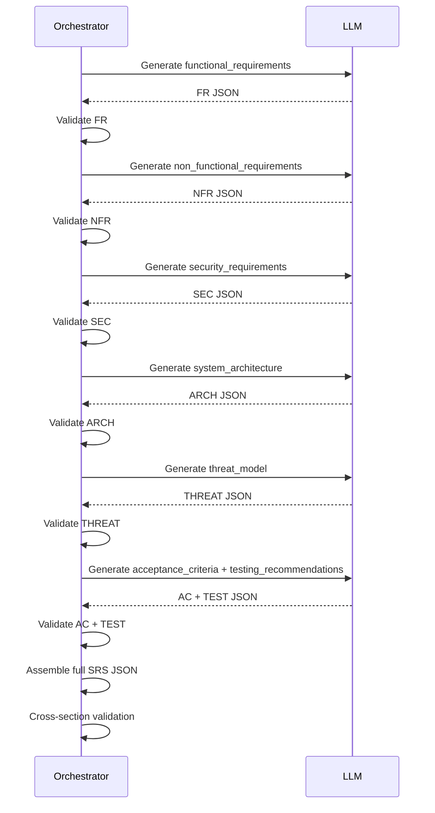

# Prompt and Output Design — CyberSRS

**Version:** 0.1.0-draft
**Date:** 2026-08-07
**Status:** Phase 0 — Planning

> This document defines the planned prompt architecture and structured output schemas for all LLM interactions. Actual prompt text will be refined during implementation.

---

## 1. General Prompt Architecture

All prompts follow a consistent structure:

```
SYSTEM: [Task-specific system instructions + output schema]
USER:   [User content + retrieved context (if applicable)]
```

**Rules:**
- System role contains only instructions and the expected JSON schema.
- User role contains the user's input and any retrieved RAG context.
- Retrieved chunks are placed in a clearly delimited section within the user message (SEC-019).
- User-supplied text is sanitised before inclusion (SEC-012).
- Every prompt specifies the exact JSON output schema.
- The prompt includes one or two examples of the expected output format.

---

## 2. Prompt Definitions

### 2.1 Project-Context Extraction

| Attribute | Value |
|---|---|
| **Purpose** | Analyse an informal project description to extract structured context. |
| **Required input** | Project description (sanitised free text). |
| **Expected output** | `ProjectAnalysis` JSON. |
| **Failure conditions** | Invalid JSON; missing required fields; empty arrays for critical fields. |
| **Validation approach** | Pydantic model `ProjectAnalysis` with required fields. |
| **Retry approach** | Append the validation error and the schema to a corrective prompt. |
| **Maximum retries** | `CYBERSRS_LLM_MAX_RETRIES` (default 3). |
| **Deterministic checks** | Verify `inferred_categories` contains only valid CAT-01–CAT-08 values. Verify `stakeholders`, `assets`, `users`, `goals` are non-empty. |

**Output schema:**
```json
{
  "stakeholders": ["string"],
  "assets": ["string"],
  "users": ["string"],
  "constraints": ["string"],
  "goals": ["string"],
  "inferred_categories": ["CAT-01"],
  "missing_information": ["string"],
  "project_summary": "string"
}
```

### 2.2 Subdomain Inference

This is performed as part of the project-context extraction (§2.1), not as a separate prompt. The `inferred_categories` field is populated during analysis.

**Deterministic checks:**
- Each inferred category must be one of CAT-01 through CAT-08.
- If no category matches, the unsupported-project path is triggered (USER_WORKFLOW §3.3).
- The user never selects a category; inference is always automatic.

### 2.3 Missing-Information Detection

Also part of the project-context extraction (§2.1). The `missing_information` field lists detected gaps.

**Deterministic checks:**
- If `missing_information` is non-empty, trigger clarification-question generation.
- If `missing_information` is empty, skip clarification and proceed to SRS generation.

### 2.4 Clarification-Question Generation

| Attribute | Value |
|---|---|
| **Purpose** | Generate targeted clarification questions from detected information gaps. |
| **Required input** | Project description; `ProjectAnalysis` result; `missing_information` array. |
| **Expected output** | `ClarificationQuestionSet` JSON. |
| **Failure conditions** | Invalid JSON; zero questions when gaps were detected; questions unrelated to the project. |
| **Validation approach** | Pydantic model `ClarificationQuestionSet`. |
| **Retry approach** | Corrective prompt with error details. |
| **Maximum retries** | 3. |
| **Deterministic checks** | At least 1 question generated. `is_critical` field is boolean. `display_order` values are sequential. |

**Output schema:**
```json
{
  "questions": [
    {
      "question_text": "string",
      "reason": "string",
      "is_critical": true,
      "target_gap": "string"
    }
  ]
}
```

### 2.5 Retrieval-Query Generation

| Attribute | Value |
|---|---|
| **Purpose** | Construct queries optimised for vector-store retrieval from the project context. |
| **Required input** | `ProjectContext` (enriched after clarification). |
| **Expected output** | A list of query strings (may be generated deterministically rather than by LLM). |
| **Failure conditions** | N/A if deterministic; if LLM-based: invalid format. |
| **Validation approach** | Check that each query is a non-empty string. |
| **Retry approach** | Fall back to deterministic query construction (concatenation of categories + goals). |
| **Maximum retries** | 1 (then fall back). |
| **Deterministic checks** | At least 1 query string produced. |

**Design note:** This step may be implemented deterministically (no LLM call) in the MVP. The prompt is defined in case LLM-based query expansion proves useful during experimentation.

### 2.6 SRS Generation

| Attribute | Value |
|---|---|
| **Purpose** | Generate the complete SRS as structured JSON. |
| **Required input** | `ProjectContext`; retrieved chunks (with metadata); inferred categories; target SRS section. |
| **Expected output** | SRS section JSON (one section per call — see §3 for sectioned approach). |
| **Failure conditions** | Invalid JSON; missing required fields; requirement IDs not unique; hallucinated citations. |
| **Validation approach** | Pydantic models per section (see §4). |
| **Retry approach** | Corrective prompt with validation errors. |
| **Maximum retries** | 3. |
| **Deterministic checks** | Requirement IDs follow the naming convention. Citation `source_id` values exist in the retrieved chunks. No duplicate requirement IDs within a section. |

**Generation is sectioned:** Each SRS section is generated in a separate LLM call to reduce output complexity and improve reliability:

1. `functional_requirements`
2. `non_functional_requirements`
3. `security_requirements`
4. `system_architecture`
5. `acceptance_criteria`
6. `testing_recommendations`

The `threat_model` is generated separately (§2.7).

### 2.7 Threat Generation

| Attribute | Value |
|---|---|
| **Purpose** | Generate a threat model for the project. |
| **Required input** | `ProjectContext`; `system_architecture` (from prior generation); retrieved chunks on threat intelligence. |
| **Expected output** | `ThreatModel` JSON. |
| **Failure conditions** | Invalid JSON; threats without mitigations; mitigations without related requirements. |
| **Validation approach** | Pydantic model `ThreatModel`. |
| **Retry approach** | Corrective prompt. |
| **Maximum retries** | 3. |
| **Deterministic checks** | Each threat has ≥ 1 mitigation. `severity` is one of `critical`, `high`, `medium`, `low`. STRIDE `category` is valid. |

### 2.8 Requirement Validation

| Attribute | Value |
|---|---|
| **Purpose** | Assess the quality of generated requirements (completeness, testability, consistency). |
| **Required input** | Complete SRS JSON. |
| **Expected output** | `ValidationReport` JSON. |
| **Failure conditions** | Invalid JSON; report does not cover all sections. |
| **Validation approach** | Pydantic model `ValidationReport`. |
| **Retry approach** | Corrective prompt. |
| **Maximum retries** | 2 (validation is a secondary check; don't over-retry). |
| **Deterministic checks** | `overall_score` is 0–100. Each issue references a valid section and requirement ID. |

**Hybrid approach:** Some validation checks are deterministic (e.g., "are all mandatory sections present?", "does every requirement have an ID?") and run without the LLM. The LLM is used for subjective quality assessments (testability, ambiguity, consistency).

### 2.9 Selected-Section Regeneration

| Attribute | Value |
|---|---|
| **Purpose** | Regenerate one or more specific SRS sections without regenerating the entire document. |
| **Required input** | `ProjectContext`; retrieved chunks; existing SRS JSON (for context); list of sections to regenerate. |
| **Expected output** | Regenerated section JSON (same schema as original). |
| **Failure conditions** | Same as §2.6. |
| **Validation approach** | Same Pydantic models as §2.6. |
| **Retry approach** | Same as §2.6. |
| **Maximum retries** | 3. |
| **Deterministic checks** | Regenerated section integrates with existing SRS (no ID conflicts with retained sections). New requirement IDs do not duplicate existing ones. |

---

## 3. Sectioned Generation Strategy

To avoid overwhelming a 4B model with a single massive prompt:



Each call receives the full project context and retrieved chunks, but is asked to produce only one section. Previously generated sections are summarised (not included in full) to save context tokens.

---

## 4. Complete SRS JSON Schema (Conceptual)

Each generated requirement includes the following fields:

| Field | Type | Required | Description |
|---|---|---|---|
| `id` | string | Yes | Unique requirement ID (e.g., `FR-001`, `SEC-003`) |
| `category` | enum | Yes | `functional`, `non_functional`, `security` |
| `title` | string | Yes | Short title (e.g., "User Authentication") |
| `statement` | string | Yes | Testable "The system shall…" text |
| `rationale` | string | Yes | Why this requirement is needed |
| `priority` | enum | Yes | `must`, `should`, `could` |
| `acceptance_criteria` | string | Yes | How to verify the requirement is met |
| `dependencies` | string[] | No | IDs of other requirements this depends on |
| `source_references` | object[] | No | Retrieved chunks that informed this requirement (see below) |
| `confidence` | enum | Yes | `high`, `medium`, `low` — model's self-assessed confidence |
| `user_confirmed` | boolean | Yes | `false` initially; set to `true` when user approves or edits |

**Source reference structure:**
```json
{
  "source_id": "uuid",
  "document_title": "string",
  "section_heading": "string",
  "relevance_score": 0.87
}
```

**Full SRS structure:** See [DATA_MODEL.md §3](DATA_MODEL.md#3-srs-json-schema) for the complete SRS JSON schema. This document extends it with the `title`, `confidence`, and `user_confirmed` fields.

---

## 5. Malformed Output Handling

### 5.1 Invalid JSON

| Scenario | Handling |
|---|---|
| LLM returns non-JSON text (e.g., Markdown) | Attempt to extract JSON from the response using regex. If extraction fails, retry with corrective prompt. |
| LLM returns JSON with syntax errors | Include the syntax error in the corrective prompt. |
| LLM returns valid JSON that fails Pydantic validation | Include the validation errors in the corrective prompt. |

### 5.2 Partial JSON

| Scenario | Handling |
|---|---|
| JSON is truncated (incomplete) | Likely context-window overflow. Retry with a shorter prompt or request fewer items. Log the truncation. |
| Some fields present, others missing | If required fields are missing, retry. If optional fields are missing, accept with defaults. |

### 5.3 Unsupported Citations

| Scenario | Handling |
|---|---|
| Citation references a `source_id` not in the retrieved chunks | Remove the citation from the requirement. Flag in the validation report. (SEC-038). |
| Citation references a chunk that exists but was not retrieved for this generation | Remove the citation (the model hallucinated it from training data). Flag in the validation report. |
| No citations on a requirement in a RAG-augmented generation | Accept — not all requirements need RAG backing. Mark `source_references` as empty. |

---

## 6. Prompt Versioning

All prompt templates will be versioned with a semantic version string (e.g., `v1.0.0`). The version is recorded in `GenerationRun.prompt_template_version` for reproducibility.

Changes to prompts that affect output structure require a version bump and re-evaluation.
