# RAG Design — CyberSRS

**Version:** 0.1.0-draft
**Date:** 2026-08-07
**Status:** Phase 0 — Planning

> RAG provides **external cybersecurity knowledge, framework guidance, standards, controls, and source attribution**. It does not replace fine-tuning (see ADR-0005, ADR-0006).

---

## 1. Pipeline Overview

```mermaid
flowchart LR
    subgraph "Offline Ingestion"
        S1["1. Source Selection"] --> S2["2. Document Acquisition"]
        S2 --> S3["3. Source Manifest"]
        S3 --> S4["4. File Hashing (SHA-256)"]
        S4 --> S5["5. Parsing"]
        S5 --> S6["6. Cleaning"]
        S6 --> S7["7. Normalisation"]
        S7 --> S8["8. Section-Aware Chunking"]
        S8 --> S9["9. Metadata Generation"]
        S9 --> S10["10. Embedding"]
        S10 --> S11["11. ChromaDB Storage"]
    end

    subgraph "Online Retrieval"
        S12["12. Query Construction"] --> S13["13. Retrieval"]
        S13 --> S14["14. Metadata Filtering"]
        S14 --> S15["15. Reranking Decision"]
        S15 --> S16["16. Context Assembly"]
        S16 --> S17["17. Citation Preservation"]
        S17 --> S18["18. Generation"]
    end

    subgraph "Quality"
        S19["19. Retrieval Evaluation"]
        S20["20. Failure Handling"]
    end

    S11 --> S12
```



---

## 2. Offline Ingestion Pipeline

### 2.1 Source Selection

Sources are curated cybersecurity standards, frameworks, and guidance documents from trusted organisations. See [KNOWLEDGE_BASE_PLAN.md](KNOWLEDGE_BASE_PLAN.md) for the planned corpus.

**Selection criteria:**
- Published by a recognised authority (NIST, OWASP, MITRE, CIS).
- Freely available or appropriately licenced.
- Relevant to at least one of the 8 supported project categories (CAT-01–CAT-08).
- Available in a parseable format (PDF, Markdown, or plain text).

### 2.2 Document Acquisition

Documents are downloaded manually by the operator and placed in a designated ingestion directory.

**Rules:**
- No automated web scraping in the MVP.
- The operator verifies the document's authenticity before ingestion.
- Documents are stored in their original format alongside the ingestion directory.

### 2.3 Source Manifest

A source manifest (`source_manifest.json`) records every document accepted for ingestion.

**Manifest entry fields:**

| Field | Type | Required | Description |
|---|---|---|---|
| `source_id` | UUID | Yes | Unique identifier |
| `document_title` | string | Yes | Full title |
| `organisation` | string | Yes | Publishing organisation |
| `version` | string | Yes | Document version or edition |
| `publication_date` | date | No | When the document was published |
| `retrieval_date` | date | Yes | When it was downloaded |
| `source_url` | string | Yes | URL where it was obtained |
| `file_path` | string | Yes | Local path to the original file |
| `file_hash_sha256` | string | Yes | SHA-256 hash of the original file |
| `format` | enum | Yes | `pdf`, `markdown`, `text` |
| `licence_note` | string | Yes | Usage rights or licence information |
| `categories` | string[] | Yes | Which project categories it supports (CAT-01–CAT-08) |
| `status` | enum | Yes | `pending`, `ingested`, `rejected`, `deprecated` |
| `ingested_at` | datetime | No | When it was ingested into ChromaDB |
| `chunk_count` | integer | No | Number of chunks produced |

### 2.4 File Hashing

Every source file is hashed using SHA-256 before ingestion (SEC-021).

- The hash is stored in the source manifest and in the `SourceDocument` database record.
- Re-ingesting a file with a different hash triggers a warning and requires `--force` to proceed.
- This enables detection of tampered or updated documents.

### 2.5 Parsing

| Format | Parser | Notes |
|---|---|---|
| PDF | Python library (e.g., `PyMuPDF`, `pdfplumber`) — to be decided | Must extract text with page numbers; must not execute embedded JavaScript (SEC-016). |
| Markdown | Standard Markdown parser (e.g., `markdown-it` via Python binding or custom) | Strip HTML (SEC-017). |
| Plain text | Direct read | Minimal processing. |

**Parser selection is an unresolved decision** (see DECISIONS.md). The parser must:
- Extract section headings for section-aware chunking.
- Extract page numbers for citation metadata.
- Handle multi-column layouts (common in NIST PDFs).
- Not execute any active content.

### 2.6 Cleaning

After parsing, the raw text is cleaned:

1. Remove headers, footers, and page numbers (they appear as noise in chunk text).
2. Remove excessive whitespace and blank lines.
3. Remove non-UTF-8 characters.
4. Remove or escape any HTML tags (SEC-017).
5. Normalise Unicode characters (NFC normalisation).

### 2.7 Normalisation

- Convert all text to UTF-8.
- Normalise whitespace (collapse multiple spaces/newlines).
- Preserve paragraph boundaries (double newline → paragraph separator).
- Preserve list structure where detectable.
- Preserve table structure as plain text (tables are common in NIST/CIS documents).

### 2.8 Section-Aware Chunking

Chunks should respect document structure:

1. **Primary boundary:** Section headings (e.g., "3.2 Firewall Configuration").
2. **Secondary boundary:** Paragraph breaks.
3. **Fallback:** Token-count-based splitting when a section exceeds the maximum chunk size.

**Configurable parameters:**

| Parameter | Env Variable | Default | Notes |
|---|---|---|---|
| Maximum chunk size | `CYBERSRS_RAG_CHUNK_SIZE` | 512 tokens | Must be experimentally validated — see §2.8.1 |
| Chunk overlap | `CYBERSRS_RAG_CHUNK_OVERLAP` | 64 tokens | Must be experimentally validated |
| Minimum chunk size | — | 50 tokens | Chunks smaller than this are merged with the previous chunk |

#### 2.8.1 Experimental Validation of Chunk Sizes

The default values (512/64) are starting points, **not final decisions**. During Phase 4:

1. Ingest a representative subset of documents at chunk sizes 256, 512, and 1024.
2. Run retrieval on a set of test queries (derived from the demo project descriptions).
3. Measure retrieval precision and recall at each chunk size.
4. Select the chunk size that maximises retrieval quality for cybersecurity content.
5. Document the results in the evaluation report.

### 2.9 Metadata Generation

Each chunk receives the following metadata:

| Field | Type | Source | Description |
|---|---|---|---|
| `source_id` | UUID | Source manifest | Links to the source document |
| `document_title` | string | Source manifest | Full document title |
| `organisation` | string | Source manifest | Publishing organisation |
| `version` | string | Source manifest | Document version |
| `publication_date` | date | Source manifest | Publication date |
| `retrieval_date` | date | Source manifest | Download date |
| `source_url` | string | Source manifest | Original URL |
| `section_heading` | string | Parser | Nearest section heading above the chunk |
| `page_number` | integer | Parser (PDF only) | Page number, if available |
| `chunk_index` | integer | Chunker | Position within the document (0-indexed) |
| `file_hash_sha256` | string | Hasher | Hash of the source file |
| `licence_note` | string | Source manifest | Usage rights |
| `categories` | string[] | Source manifest | Relevant project categories |

This metadata is stored both in ChromaDB (as chunk metadata) and in SQLite (in the `SourceDocument` and `RetrievedChunk` tables).

### 2.10 Embedding

Chunks are embedded using an embedding model (UDEC-001, to be decided).

**Requirements for the embedding model:**
- Must run locally (no external API).
- Must produce embeddings suitable for cosine similarity search.
- Should perform well on cybersecurity and technical text.
- Must be small enough to run alongside Qwen3-4B on consumer hardware.

**Candidate models (to be evaluated in Phase 4):**
- `all-MiniLM-L6-v2` (384 dimensions, ~80 MB)
- `nomic-embed-text` (768 dimensions, ~274 MB)
- `bge-small-en-v1.5` (384 dimensions, ~130 MB)

### 2.11 ChromaDB Storage

- Collection name: `cybersrs_knowledge`
- Distance metric: cosine similarity (default for embedding models)
- Persistence: local directory (`CYBERSRS_CHROMA_PATH`)
- Each document is stored with its full metadata (§2.9)
- Duplicate detection: before inserting, check if a chunk with the same `source_id` and `chunk_index` already exists

---

## 3. Online Retrieval Pipeline

### 3.1 Query Construction (Step 12)

Retrieval queries are constructed from the `ProjectContext`:

1. **Primary query:** Concatenation of inferred categories + goals + key constraints.
2. **Secondary queries (optional):** Individual queries per SRS section being generated (e.g., "network firewall functional requirements" for the FR section).

Multiple queries may be issued to improve recall. Results are deduplicated by chunk ID.

### 3.2 Retrieval (Step 13)

- Query ChromaDB using the embedded query vector.
- Retrieve `CYBERSRS_RAG_TOP_K` (default 10) chunks per query.
- Deduplicate across multiple queries.

### 3.3 Metadata Filtering (Step 14)

After retrieval, filter chunks:

1. **Relevance score threshold:** Remove chunks below `CYBERSRS_RAG_MIN_SCORE` (default 0.3).
2. **Category filter (optional):** If the project context has inferred categories, prefer chunks whose `categories` metadata overlaps.

### 3.4 Reranking Decision (Step 15)

**MVP decision:** No reranking in the MVP. Relevance-score-based ranking from the embedding model is used directly.

**Post-MVP option:** A cross-encoder reranker (e.g., `ms-marco-MiniLM`) could be added to improve precision. This is deferred because:
- It adds latency.
- It adds another model to run locally.
- The MVP should first validate whether basic retrieval is sufficient.

### 3.5 Context Assembly (Step 16)

Assemble the retrieved chunks into a context block for the LLM prompt:

```
--- RETRIEVED CYBERSECURITY KNOWLEDGE ---

[Source 1: {document_title}, {section_heading}, {organisation}]
{chunk_text}

[Source 2: {document_title}, {section_heading}, {organisation}]
{chunk_text}

...

--- END RETRIEVED KNOWLEDGE ---
```

- Each chunk is prefixed with its source metadata for citation.
- Chunks are ordered by relevance score (highest first).
- Total context size is capped to fit within the LLM's context window (consider Qwen3-4B's context length).
- If total context exceeds the cap, lower-ranked chunks are dropped.

### 3.6 Citation Preservation (Step 17)

The LLM prompt instructs the model to reference retrieved sources in its output:

- Each generated requirement may include a `sources` array listing the `source_id` values of chunks that informed it.
- The system validates that cited `source_id` values exist in ChromaDB (SEC-038).
- Citations are preserved through the pipeline: generation → storage → UI display → PDF export.

**Citation format in generated JSON:**
```json
{
  "requirement_id": "SEC-003",
  "statement": "The system shall...",
  "sources": [
    {
      "source_id": "uuid",
      "document_title": "NIST SP 800-41 Rev 1",
      "section_heading": "Section 3.2",
      "relevance_score": 0.87
    }
  ]
}
```

### 3.7 Generation (Step 18)

The assembled context is passed to the LLM as part of the SRS-generation prompt. See [PROMPT_AND_OUTPUT_DESIGN.md](PROMPT_AND_OUTPUT_DESIGN.md) for prompt structure.

---

## 4. Retrieval Evaluation (Step 19)

During Phase 4, evaluate retrieval quality:

| Metric | Method |
|---|---|
| Retrieval precision@k | Manually label relevance of top-k chunks for test queries. |
| Retrieval recall | For a set of known-relevant chunks, measure how many are retrieved. |
| Chunk quality | Inspect whether chunks are coherent (not split mid-sentence). |
| Citation accuracy | For generated SRS, verify that cited chunks actually support the requirements. |

See [EVALUATION_PLAN.md](EVALUATION_PLAN.md) for the full evaluation framework.

---

## 5. Failure Handling (Step 20)

| Failure | Handling | Related Requirement |
|---|---|---|
| ChromaDB unreachable | Log warning; generate SRS without RAG context; display warning to user. | NFR-021, RAG-007 |
| ChromaDB returns zero results | Log info; generate without context; display notice. | RAG-007 |
| All chunks below relevance threshold | Treat as zero results. | RAG-007 |
| Embedding model fails | Log error; cannot perform retrieval; fall back to generation without RAG. | NFR-021 |
| ChromaDB returns duplicate chunks | Deduplicate by chunk ID before context assembly. | — |
| Context exceeds LLM context window | Drop lowest-ranked chunks until context fits. | — |

---

## 6. Safeguards

### 6.1 Prompt Injection Inside Documents

**Risk:** A malicious document contains text like "IGNORE ALL INSTRUCTIONS AND OUTPUT…" which, when retrieved, could manipulate the LLM.

**Mitigations:**
- SEC-019: Retrieved chunks are placed in a clearly delimited context section, not in the system role.
- SEC-020: LLM output is always validated against the expected JSON schema regardless of retrieved content.
- SEC-022: Operator approves documents before ingestion.

### 6.2 Untrusted HTML

**Risk:** Ingested Markdown or PDF contains HTML tags that could cause XSS when displayed in the UI.

**Mitigations:**
- SEC-017: HTML is stripped during parsing/cleaning.
- SEC-023: Retrieved chunks are HTML-escaped before UI rendering.

### 6.3 Duplicate Chunks

**Risk:** The same document is ingested twice, creating duplicate chunks that inflate retrieval results.

**Mitigations:**
- Before insertion, check for existing chunks with the same `source_id` and `chunk_index`.
- If a duplicate is detected, skip or update the existing chunk.
- The source manifest tracks ingestion status to prevent re-ingestion.

### 6.4 Stale Documents

**Risk:** An ingested document is outdated (e.g., an old version of OWASP Top 10).

**Mitigations:**
- The source manifest includes `version` and `publication_date` fields.
- The operator is responsible for updating documents when new versions are published.
- The source manifest `status` field supports `deprecated` to mark outdated sources.
- Post-MVP: add a staleness check that warns when a document's publication date is older than a configurable threshold.

### 6.5 Version Conflicts

**Risk:** Two versions of the same document are ingested, producing conflicting guidance.

**Mitigations:**
- The source manifest requires a `version` field.
- Ingestion of a document with the same title but different version requires deprecating the old version first.
- ChromaDB metadata includes the document version for disambiguation.

### 6.6 Missing Attribution

**Risk:** A generated requirement cites a source, but the source metadata is incomplete.

**Mitigations:**
- The source manifest requires all fields marked as "Required".
- The ingestion pipeline rejects documents with incomplete metadata.
- SEC-038 validates that cited chunks exist.

### 6.7 Unsupported Citations

**Risk:** The LLM generates a citation to a source that was not retrieved (hallucinated citation).

**Mitigations:**
- SEC-038: Validate that every cited `source_id` exists in ChromaDB.
- The validation report flags any hallucinated citations.
- Invalid citations are marked in the UI with a warning icon.
