# Development Roadmap — CyberSRS

**Version:** 0.1.0-draft
**Date:** 2026-08-07
**Status:** Phase 0 — Planning

---

## Phase Overview

```mermaid
gantt
    title CyberSRS Phased Roadmap
    dateFormat  YYYY-MM-DD
    axisFormat  %b

    section Planning
    Phase 0: Planning              :done, p0, 2026-08-01, 7d

    section Foundation
    Phase 1: App Skeleton          :p1, after p0, 10d
    Phase 2: Base Model            :p2, after p1, 7d

    section Core Generation
    Phase 3: SRS Generation        :p3, after p2, 10d
    Phase 4: RAG Pipeline          :p4, after p3, 10d
    Phase 5: Validation            :p5, after p4, 7d

    section UI and Export
    Phase 6: PDF and Editing       :p6, after p5, 10d

    section Fine-Tuning
    Phase 7: Dataset Prep          :p7, after p6, 7d
    Phase 8: QLoRA Training        :p8, after p7, 7d
    Phase 9: Evaluation            :p9, after p8, 7d

    section Polish
    Phase 10: Testing and Docs     :p10, after p9, 10d
```

---

## Phase 0 — Planning and Repository Governance

**Objective:** Establish the project's planning documents, governance rules, and repository structure before any code is written.

**Inputs:**
- Project brief and informal requirements from the student.
- Fixed technology decisions.

**Tasks:**
1. Create `README.md` with project summary, documentation map, and status.
2. Create `AGENTS.md` with coding-agent instructions.
3. Create `docs/PRD.md` — Product Requirements Document.
4. Create `docs/SCOPE.md` — scope boundaries.
5. Create `docs/USER_WORKFLOW.md` — end-to-end workflow.
6. Create `docs/REQUIREMENTS_CATALOG.md` — traceable requirements.
7. Create `docs/ARCHITECTURE.md` — system architecture.
8. Create `docs/DATA_MODEL.md` — conceptual data model.
9. Create `docs/API_CONTRACT.md` — API endpoint plan.
10. Create `docs/ROADMAP.md` — this document.
11. Create `docs/DECISIONS.md` — approved and unresolved decisions.
12. Create `docs/GLOSSARY.md` — terminology.
13. Create ADRs (0001–0004).
14. Cross-check all documents for consistency.

**Deliverables:**
- All planning documents listed above.
- No application code.

**Dependencies:** None.

**Risks:**
- Over-planning or under-planning scope.

**Completion gate:**
- [ ] All 16 documents exist and are internally consistent.
- [ ] No contradictions across documents.
- [ ] Requirement IDs are unique.
- [ ] No document claims code has been written.

**Tests required:** Manual review of all documents.

---

## Phase 1 — Non-AI Application Skeleton

**Objective:** Build the foundational application structure — frontend scaffold, backend scaffold, database, and project CRUD — without any LLM integration.

**Inputs:**
- `ARCHITECTURE.md`, `DATA_MODEL.md`, `API_CONTRACT.md`.

**Tasks:**
1. Set up the Python project structure with FastAPI.
2. Set up the React/TypeScript/Vite frontend scaffold.
3. Implement the SQLite database layer with schema migrations.
4. Implement the `LLMProvider` abstract interface (no concrete provider yet).
5. Implement project CRUD endpoints (POST, GET, PUT, DELETE).
6. Implement the health-check endpoint.
7. Implement the React project-list and project-detail UI pages.
8. Set up `.env.example` and configuration loading.
9. Set up `.gitignore` (SQLite files, `.env`, `node_modules`, etc.).
10. Set up `pytest` and basic test structure.
11. Write unit tests for database operations.
12. Write API integration tests for project CRUD.

**Deliverables:**
- Running FastAPI backend with project CRUD and health check.
- Running React frontend with project management UI.
- SQLite database with schema.
- Test suite passing.

**Dependencies:** Phase 0 complete.

**Risks:**
- SQLite schema needs to accommodate future entities — design for extension.

**Completion gate:**
- [ ] `GET /api/v1/health` returns 200.
- [ ] All project CRUD endpoints work end-to-end (API tests pass).
- [ ] React frontend can create, list, open, and delete projects.
- [ ] SQLite schema includes all entities from `DATA_MODEL.md`.
- [ ] `.env.example` exists with all `CYBERSRS_*` variables.
- [ ] All unit and integration tests pass.

**Tests required:**
- Unit tests: database CRUD operations, configuration loading.
- Integration tests: all project API endpoints.
- Manual test: create and delete a project via the UI.

---

## Phase 2 — Base-Model Integration

**Objective:** Connect the application to Ollama, implement the Ollama LLM provider, and build the description-analysis and clarification-question-generation pipelines.

**Inputs:**
- `ARCHITECTURE.md` (LLM integration section).
- `API_CONTRACT.md` (analyse and clarification endpoints).
- Ollama running locally with `qwen3:4b` pulled.

**Tasks:**
1. Implement the Ollama provider (concrete `LLMProvider` implementation).
2. Implement structured prompt templates for description analysis.
3. Implement the Project-Context Analyser service.
4. Implement JSON-schema validation for LLM output (Pydantic models for `ProjectAnalysis`).
5. Implement retry logic with corrective prompts for invalid JSON.
6. Implement the `POST /api/v1/projects/{id}/analyse` endpoint.
7. Implement structured prompt templates for clarification-question generation.
8. Implement the Clarification-Question Generator service.
9. Implement `GET /api/v1/projects/{id}/clarifications` and `POST /api/v1/projects/{id}/clarifications` endpoints.
10. Implement input sanitisation for user input before LLM prompts.
11. Implement the description-input and clarification UI in React.
12. Write unit tests for the Ollama provider (mocked HTTP).
13. Write unit tests for JSON-schema validation.
14. Write integration tests for the analysis endpoint (with mocked LLM).
15. Write integration tests for the clarification endpoints.

**Deliverables:**
- Working LLM integration via Ollama.
- Description analysis producing validated JSON.
- Clarification questions generated and answerable.
- Prompt templates documented.

**Dependencies:** Phase 1 complete. Ollama installed with `qwen3:4b`.

**Risks:**
- Qwen3-4B may struggle with structured JSON output — mitigate with detailed prompts and retry logic.
- Latency on CPU-only machines may be high.

**Completion gate:**
- [ ] `POST /projects/{id}/analyse` returns valid `ProjectAnalysis` JSON for at least 3 different project descriptions.
- [ ] Clarification questions are generated when missing information is detected.
- [ ] Retry logic works when LLM returns invalid JSON (tested with mocked bad responses).
- [ ] User can enter a description and answer questions in the React UI.
- [ ] All tests pass.

**Tests required:**
- Unit tests: Ollama provider, prompt construction, JSON validation, sanitisation.
- Integration tests: analysis endpoint (mocked LLM), clarification endpoints.
- Manual test: analyse a real description with Ollama running.

---

## Phase 3 — Structured SRS Generation

**Objective:** Implement the core SRS-generation pipeline that produces all SRS sections as validated JSON.

**Inputs:**
- `DATA_MODEL.md` (SRS JSON schema).
- `API_CONTRACT.md` (SRS generation and retrieval endpoints).
- Working LLM integration from Phase 2.

**Tasks:**
1. Implement Pydantic models for all SRS JSON sections (functional requirements, non-functional, security, architecture, acceptance criteria, testing recommendations).
2. Implement structured prompt templates for each SRS section.
3. Implement the SRS Generation Service (orchestrates multi-section generation).
4. Implement unique requirement-ID assignment.
5. Implement the `POST /api/v1/projects/{id}/srs/generate` endpoint (returns 202, async).
6. Implement the `GET /api/v1/generation-runs/{id}` status endpoint.
7. Implement the `GET /api/v1/projects/{id}/srs` endpoint.
8. Implement the `GET /api/v1/projects/{id}/srs/versions` endpoint.
9. Implement the SRS viewer UI in React (section-by-section display, navigation).
10. Implement progress indicators during generation.
11. Implement `GenerationRun` metadata logging.
12. Write unit tests for Pydantic models and ID generation.
13. Write integration tests for SRS generation (mocked LLM).
14. Write integration tests for SRS retrieval endpoints.

**Deliverables:**
- Complete SRS generation pipeline.
- All SRS sections produced as validated JSON.
- SRS viewer in the React UI.
- Generation-run tracking.

**Dependencies:** Phase 2 complete.

**Risks:**
- Multi-section generation may exceed timeout on slow hardware — implement per-section generation with progress tracking.
- JSON schema complexity may cause high retry rates.

**Completion gate:**
- [ ] `POST /projects/{id}/srs/generate` produces a complete SRS JSON conforming to the schema.
- [ ] All SRS sections (functional, non-functional, security, architecture, acceptance criteria, testing) are present.
- [ ] Each requirement has a unique ID.
- [ ] Generation-run status endpoint shows progress.
- [ ] React UI displays the SRS in a navigable, section-by-section view.
- [ ] All tests pass.

**Tests required:**
- Unit tests: Pydantic models, ID generation, prompt construction.
- Integration tests: full generation pipeline (mocked LLM), retrieval endpoints.
- Manual test: generate an SRS for a real project description.

---

## Phase 4 — RAG Ingestion and Retrieval

**Objective:** Build the knowledge-ingestion pipeline and RAG retrieval service so that SRS generation is augmented with retrieved cybersecurity knowledge.

**Inputs:**
- `ARCHITECTURE.md` (RAG section).
- Publicly available cybersecurity documents (NIST, OWASP, CIS).
- ChromaDB library.

**Tasks:**
1. Implement the Knowledge Ingestion Pipeline (CLI tool).
2. Implement document parsing (PDF, Markdown, plain text).
3. Implement configurable chunking (chunk size, overlap).
4. Select and integrate an embedding model (decision to be made; see `DECISIONS.md`).
5. Implement chunk embedding and storage in ChromaDB.
6. Implement source-document metadata preservation.
7. Implement the RAG Retrieval Service (query construction, top-k retrieval, score filtering).
8. Integrate RAG retrieval into the SRS Generation Service.
9. Implement the `GET /api/v1/projects/{id}/srs/{vid}/sources` endpoint.
10. Implement source-reference display in the React SRS viewer.
11. Implement RAG fallback (generate without context when ChromaDB is empty or unreachable).
12. Seed the knowledge base with at least 5 cybersecurity documents.
13. Write unit tests for chunking, embedding, and retrieval.
14. Write integration tests for the source-references endpoint.
15. Test RAG-augmented generation end-to-end.

**Deliverables:**
- Knowledge ingestion CLI.
- Seeded ChromaDB instance.
- RAG-augmented SRS generation.
- Source references visible in the UI.

**Dependencies:** Phase 3 complete. Embedding model selected.

**Risks:**
- Embedding model quality affects retrieval relevance.
- Chunking strategy may need tuning.

**Completion gate:**
- [ ] Ingestion pipeline processes at least 5 documents into ChromaDB.
- [ ] RAG retrieval returns relevant chunks for test queries.
- [ ] SRS generation uses retrieved chunks as context.
- [ ] Source references are displayed in the React UI.
- [ ] Fallback works when ChromaDB is empty.
- [ ] All tests pass.

**Tests required:**
- Unit tests: chunking, embedding (mocked), retrieval query construction.
- Integration tests: ingestion pipeline, source-references endpoint.
- Manual test: compare SRS quality with and without RAG.

---

## Phase 5 — Security and Requirement Validation

**Objective:** Implement the threat-model generation service and the requirement-validation service.

**Inputs:**
- `DATA_MODEL.md` (Threat, Mitigation entities).
- `API_CONTRACT.md` (validation endpoint).
- Working SRS generation from Phase 3.

**Tasks:**
1. Implement structured prompt templates for threat-model generation.
2. Implement the Threat-Model Service.
3. Implement Pydantic models for threats and mitigations.
4. Integrate threat-model generation into the SRS pipeline.
5. Implement the Requirement Validation Service.
6. Implement completeness checks (all mandatory sections present).
7. Implement testability checks (requirements have measurable criteria).
8. Implement basic consistency checks (no contradictions).
9. Implement the `POST /api/v1/projects/{id}/srs/{vid}/validate` endpoint.
10. Implement validation-issue display in the React UI (inline warnings).
11. Implement quality-score calculation.
12. Write unit tests for validation rules.
13. Write integration tests for the validation endpoint.
14. Test threat-model generation on at least 3 project types.

**Deliverables:**
- Threat-model generation integrated into SRS.
- Requirement validation with quality scoring.
- Inline validation warnings in the UI.

**Dependencies:** Phase 4 complete (for RAG-informed threat modelling).

**Risks:**
- LLM-assisted validation may produce false positives/negatives.
- Consistency checking is hard to do reliably.

**Completion gate:**
- [ ] Threat model is generated with threats and mitigations linked to requirements.
- [ ] Validation detects missing sections, untestable requirements, and basic inconsistencies.
- [ ] Quality score is computed and displayed.
- [ ] Validation issues appear inline in the React UI.
- [ ] All tests pass.

**Tests required:**
- Unit tests: validation rules, quality-score calculation.
- Integration tests: validation endpoint, threat-model generation (mocked LLM).
- Manual test: review threat models for accuracy across 3 project types.

---

## Phase 6 — PDF Generation and Editing Workflow

**Objective:** Implement PDF export, inline editing, section regeneration, and version history.

**Inputs:**
- `API_CONTRACT.md` (export, update, regenerate endpoints).
- `DATA_MODEL.md` (ExportedDocument).
- Working SRS and validation from Phases 3–5.

**Tasks:**
1. Design the PDF template (title page, table of contents, sections, traceability matrix, references, disclaimer).
2. Implement the PDF Generation Service (JSON → PDF).
3. Implement the `POST /api/v1/projects/{id}/srs/{vid}/export` endpoint.
4. Implement the `GET /api/v1/exports/{id}/download` endpoint.
5. Implement inline editing in the React UI.
6. Implement the `PUT /api/v1/projects/{id}/srs/{vid}` endpoint.
7. Implement section regeneration.
8. Implement the `POST /api/v1/projects/{id}/srs/{vid}/regenerate` endpoint.
9. Implement SRS version history display.
10. Implement the "approve" workflow step.
11. Write unit tests for PDF generation.
12. Write integration tests for export and editing endpoints.
13. Visual inspection of generated PDFs.

**Deliverables:**
- Professional PDF export.
- Inline editing and section regeneration.
- Version history.
- Complete end-to-end user workflow.

**Dependencies:** Phase 5 complete.

**Risks:**
- PDF template formatting may require iteration.
- Section regeneration must not corrupt the SRS JSON structure.

**Completion gate:**
- [ ] PDF is generated from validated SRS JSON.
- [ ] PDF includes title page, table of contents, all sections, traceability matrix, references, and disclaimer.
- [ ] User can edit requirements inline and save.
- [ ] User can regenerate individual sections.
- [ ] Version history shows all SRS versions.
- [ ] End-to-end workflow works from project creation to PDF download.
- [ ] All tests pass.

**Tests required:**
- Unit tests: PDF rendering, section update logic.
- Integration tests: export, download, update, regenerate endpoints.
- Manual test: full workflow end-to-end; visual inspection of PDF.

---

## Phase 7 — Dataset Preparation

**Objective:** Prepare a training dataset for QLoRA fine-tuning of the main LLM.

**Inputs:**
- Example project descriptions (diverse across the 8 categories).
- Reference SRS documents (curated or generated-and-corrected).
- SRS JSON schema from `DATA_MODEL.md`.

**Tasks:**
1. Define the dataset format (instruction-input-output triples).
2. Collect or author at least 50–100 training examples covering the 8 categories.
3. Ensure each example produces valid SRS JSON conforming to the schema.
4. Split into training and validation sets.
5. Create a dataset-preparation script (format conversion, validation).
6. Document the dataset in a dataset card (size, categories, format, limitations).
7. Validate the dataset for schema conformance.

**Deliverables:**
- Training and validation datasets in the required format.
- Dataset-preparation script.
- Dataset card documentation.

**Dependencies:** Phase 3 complete (SRS JSON schema finalised). Phases 4–6 helpful but not blocking.

**Risks:**
- Small dataset may limit fine-tuning effectiveness.
- Dataset quality directly affects model quality.

**Completion gate:**
- [ ] Training set contains ≥ 50 examples.
- [ ] Validation set contains ≥ 10 examples.
- [ ] All examples produce valid SRS JSON.
- [ ] Examples cover at least 6 of the 8 categories.
- [ ] Dataset card is documented.

**Tests required:**
- Schema validation on all dataset examples.
- Category-coverage analysis.

---

## Phase 8 — QLoRA Fine-Tuning

**Objective:** Fine-tune the main LLM using QLoRA to improve requirements-engineering output quality.

**Inputs:**
- Dataset from Phase 7.
- Qwen3-4B model weights.
- Hugging Face Transformers, PEFT, TRL.

**Tasks:**
1. Set up the fine-tuning environment (dependencies, GPU if available).
2. Implement the QLoRA training script using PEFT and TRL.
3. Configure training hyperparameters (LoRA rank, learning rate, epochs).
4. Run training on the prepared dataset.
5. Save the adapter weights.
6. Implement adapter loading in the Ollama provider (or Hugging Face Transformers fallback).
7. Verify the fine-tuned model produces valid SRS JSON.
8. Document training configuration and results.

**Deliverables:**
- Trained QLoRA adapter.
- Training script.
- Adapter loading integrated into the application.
- Training documentation.

**Dependencies:** Phase 7 complete. GPU recommended.

**Risks:**
- Fine-tuning on a small dataset may not yield significant improvement.
- Adapter integration with Ollama may have limitations (may need to serve via Hugging Face Transformers instead).

**Completion gate:**
- [ ] Adapter is trained and saved.
- [ ] Adapter can be loaded by the application.
- [ ] Fine-tuned model produces valid SRS JSON on the validation set.
- [ ] Training configuration is documented.

**Tests required:**
- Adapter-loading test.
- Schema validation of fine-tuned outputs on the validation set.

---

## Phase 9 — Comparative Evaluation

**Objective:** Compare base-model and fine-tuned model outputs on a reference dataset using defined metrics.

**Inputs:**
- Base model (Qwen3-4B without adapter).
- Fine-tuned model (Qwen3-4B with QLoRA adapter).
- Validation dataset from Phase 7.

**Tasks:**
1. Define evaluation metrics (completeness, consistency, testability, schema compliance, relevance).
2. Implement the Evaluation Subsystem.
3. Generate SRS outputs using the base model for all validation examples.
4. Generate SRS outputs using the fine-tuned model for all validation examples.
5. Compute metrics for both sets.
6. Produce a comparison report.
7. Document findings and conclusions.
8. Create `EvaluationRun` records in the database.

**Deliverables:**
- Evaluation script.
- Comparison report.
- Documented metrics and methodology.

**Dependencies:** Phase 8 complete.

**Risks:**
- Fine-tuned model may not show significant improvement — document findings honestly.

**Completion gate:**
- [ ] Both base and fine-tuned models have been evaluated on the same dataset.
- [ ] Metrics are computed and compared.
- [ ] Comparison report is written.
- [ ] EvaluationRun records are stored.

**Tests required:**
- Evaluation script runs without errors.
- Metrics are within expected ranges.

---

## Phase 10 — Testing, Documentation, and Demonstration

**Objective:** Final polish — comprehensive testing, documentation updates, and demonstration preparation.

**Inputs:**
- Complete application from Phases 1–9.
- All planning documents.

**Tasks:**
1. Run full test suite (unit, integration, schema validation).
2. Fix any remaining bugs.
3. End-to-end test on at least 3 diverse project descriptions.
4. Update `README.md` with actual installation and usage instructions.
5. Update all planning documents for accuracy.
6. Write a user guide or quick-start tutorial.
7. Prepare a demonstration script (project creation → PDF export).
8. Record or script a demo walkthrough.
9. Final code review and cleanup.
10. Tag a release version.

**Deliverables:**
- All tests passing.
- Updated documentation.
- Demo script or recording.
- Tagged release.

**Dependencies:** All previous phases complete.

**Risks:**
- Time pressure may force scope reduction — prioritise passing tests and accurate documentation.

**Completion gate:**
- [ ] All unit and integration tests pass.
- [ ] End-to-end workflow works for at least 3 project descriptions.
- [ ] README has real installation and usage instructions.
- [ ] Documentation is accurate and consistent.
- [ ] Demo script or recording exists.
- [ ] Repository is tagged with a version number.

**Tests required:**
- Full test suite.
- End-to-end workflow on 3 descriptions (different categories).
- PDF visual inspection.

---

## Phase Dependencies

```mermaid
graph LR
    P0["Phase 0: Planning"] --> P1["Phase 1: Skeleton"]
    P1 --> P2["Phase 2: Base Model"]
    P2 --> P3["Phase 3: SRS Generation"]
    P3 --> P4["Phase 4: RAG"]
    P4 --> P5["Phase 5: Validation"]
    P5 --> P6["Phase 6: PDF + Editing"]
    P3 --> P7["Phase 7: Dataset Prep"]
    P7 --> P8["Phase 8: QLoRA"]
    P8 --> P9["Phase 9: Evaluation"]
    P6 --> P10["Phase 10: Testing + Docs"]
    P9 --> P10
    P10 --> FA["Future Phase A: SDLC Catalogue"]
    FA --> FB["Future Phase B: Development Profile"]
    FB --> FC["Future Phase C: SDLC Selection"]
    FC --> FD["Future Phases D-F: Mapping + Verification"]
    FD --> FG["Future Phases G-J: Plan + UI + Evaluation + Deployment"]
```



> **Note:** Phase 7 (Dataset Preparation) can begin as soon as Phase 3 is complete, in parallel with Phases 4–6. This is intentional to allow the fine-tuning track to proceed without waiting for all UI features.

---

## Future Extension - SDLC and Development Planner

> **FUTURE WORK - NOT YET IMPLEMENTED.** This extension begins only after the
> current QLoRA fine-tuning, comparative evaluation, and Phase 10 completion
> gates have passed. It must not alter the frozen evaluation baseline or current
> cybersecurity RAG pipeline.

The next major product stage will use an approved SRS to recommend an
explainable SDLC or hybrid methodology and generate a requirement-by-requirement
Software Development Plan. The planned sequence is:

| Future phase | Objective |
|---|---|
| A | Build the controlled, versioned SDLC knowledge catalogue |
| B | Extract a provenance-backed Project Development Profile |
| C | Implement deterministic scoring and constrained recommendation reasoning |
| D | Map every approved SRS requirement to implementation work |
| E | Analyze requirement dependencies and development order |
| F | Map requirements and acceptance criteria to verification work |
| G | Assemble, validate, version, and export the Software Development Plan |
| H | Add methodology comparison, plan review, traceability, and approval UI |
| I | Evaluate selection quality, mapping relevance, and traceability |
| J | Complete local deployment and separately approved integration boundaries |

The architecture, schemas, tests, completion gates, model strategy, RAG
separation, and phase-by-phase file plan are defined in
[`FUTURE_SDLC_AND_DEVELOPMENT_PLANNER.md`](FUTURE_SDLC_AND_DEVELOPMENT_PLANNER.md).
