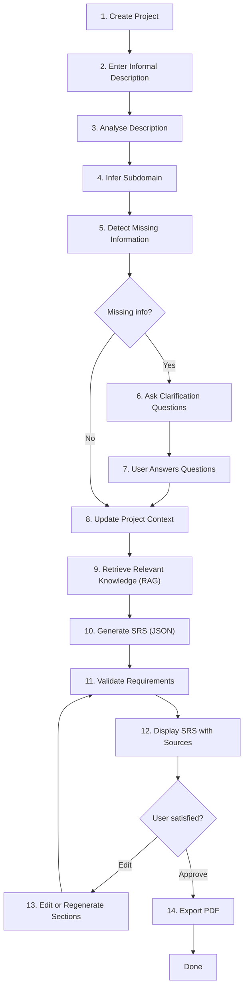
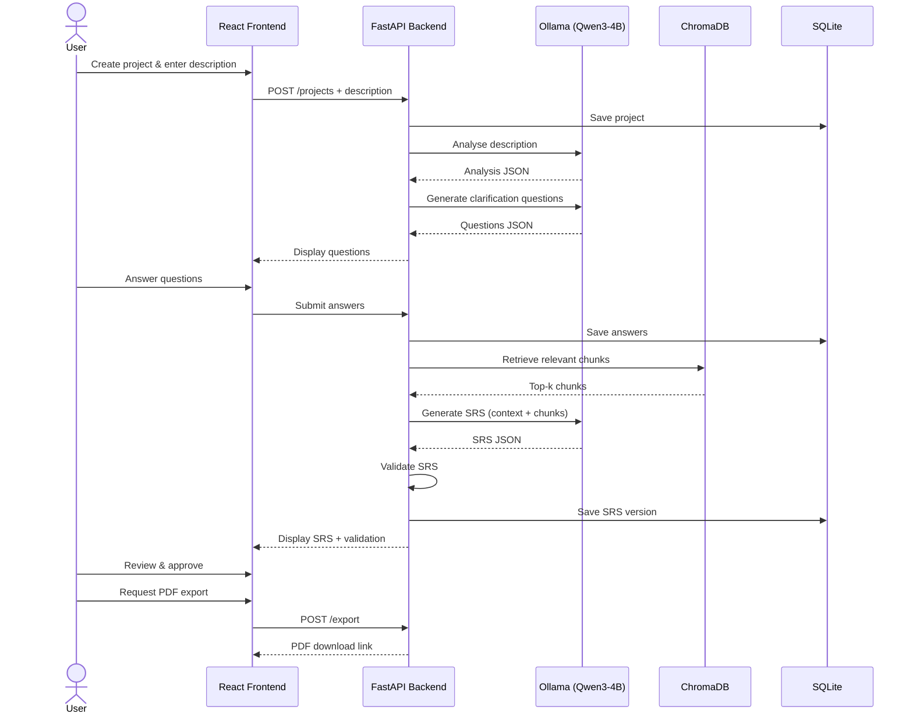
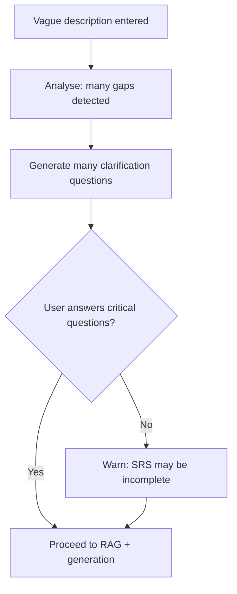
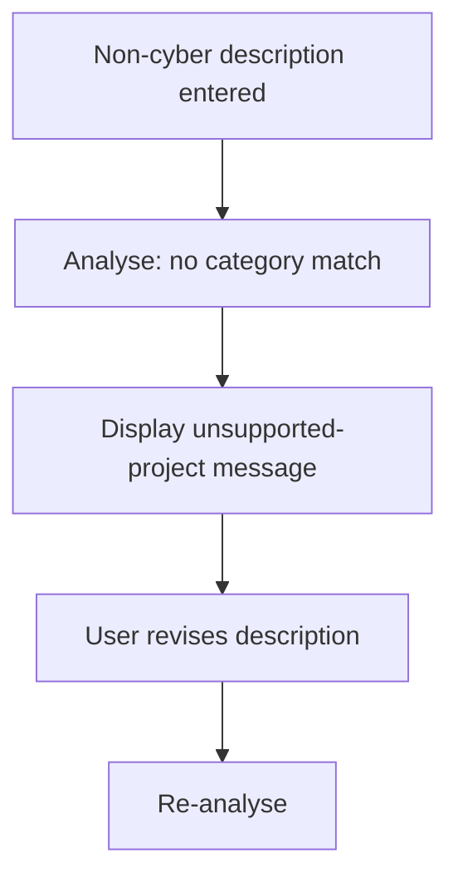
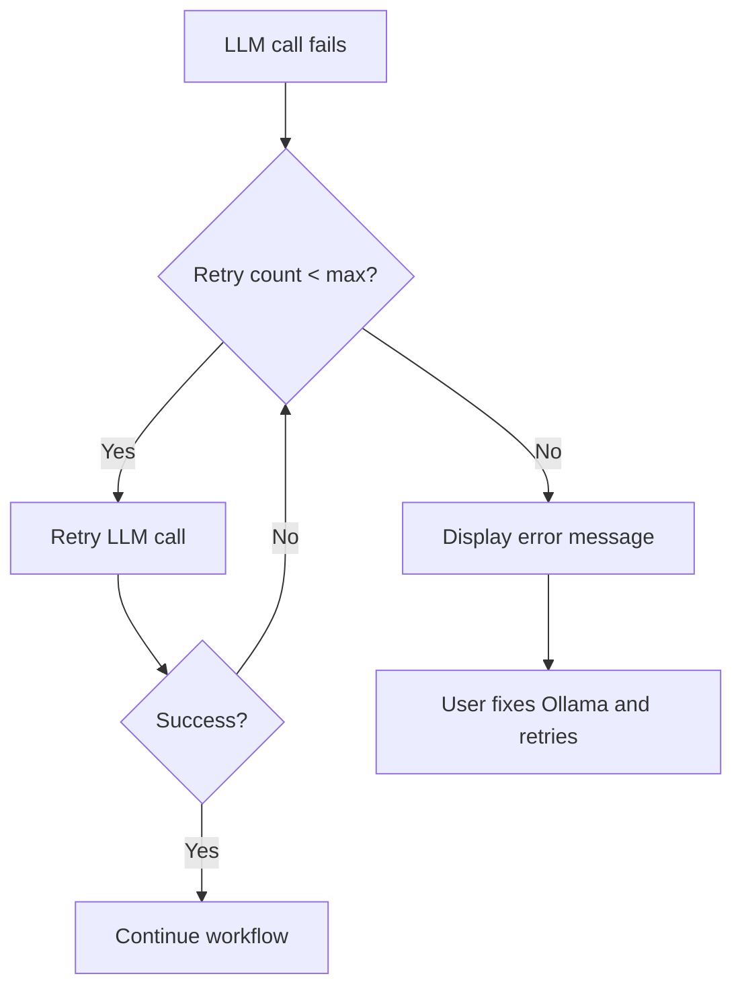
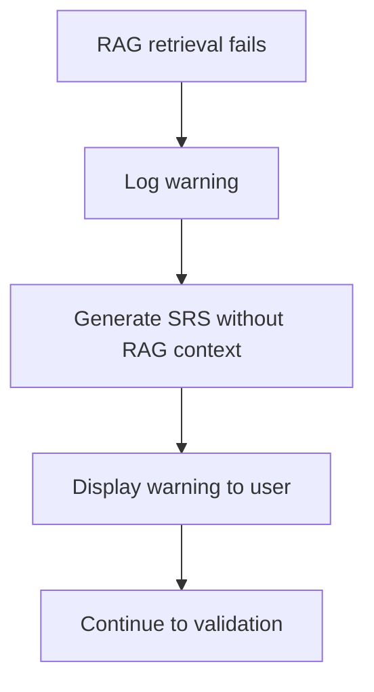
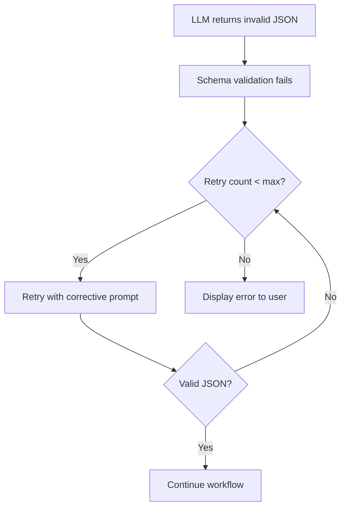
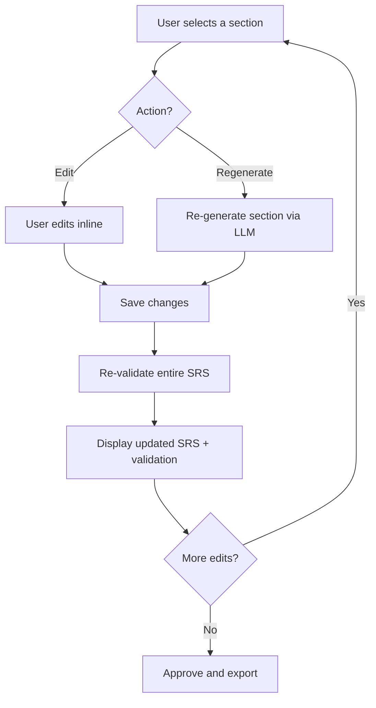
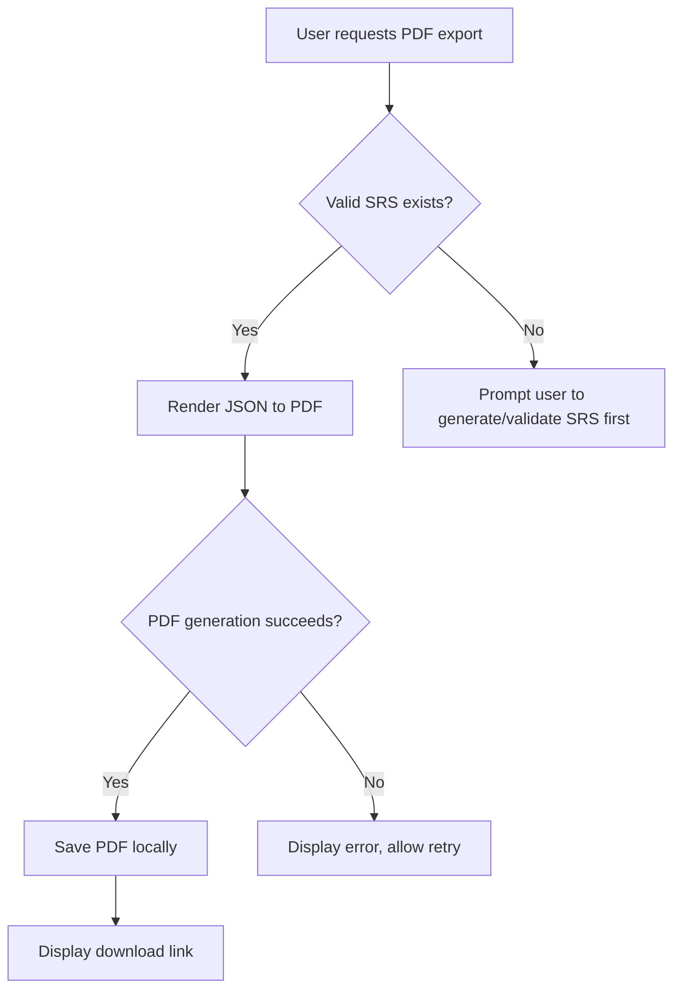

# User Workflow — CyberSRS

**Version:** 0.1.0-draft
**Date:** 2026-08-07
**Status:** Phase 0 — Planning

---

## 1. Workflow Overview

CyberSRS guides the user through a linear workflow from project creation to PDF export. The user provides only an informal project description; every other decision (domain inference, clarification questions, requirement structure) is handled by the system.

---

## 2. Step-by-Step Workflow

### Step 1 — Create a Project

The user opens CyberSRS and creates a new project by entering a project name.

- **Input:** Project name (free text).
- **Output:** A new project record is created in the database.
- **UI state:** Project-creation form.

### Step 2 — Enter an Informal Description

The user writes a plain-English description of the cybersecurity system they want to build.

- **Input:** Informal description (free text, at least one sentence).
- **Example:** *"I want to build a firewall and network-monitoring system for a college campus."*
- **Output:** Description is saved to the project record.
- **UI state:** Description-entry form with a text area and a "Submit" button.
- **Constraint:** The user is **never** asked to select a domain, category, or template.

### Step 3 — Analyse the Description

The system sends the description to the main LLM with a structured analysis prompt.

- **Processing:** The LLM extracts stakeholders, assets, users, constraints, and goals.
- **Output:** A validated JSON object conforming to the `ProjectAnalysis` schema.
- **UI state:** Progress indicator ("Analysing your description…").

### Step 4 — Infer the Subdomain

The system infers one or more cybersecurity subdomain(s) from the analysis result.

- **Processing:** The LLM maps extracted concepts to the supported category list (CAT-01 through CAT-08).
- **Output:** One or more inferred categories stored in the project context.
- **UI state:** The inferred category is displayed to the user for transparency (not for selection).

### Step 5 — Detect Missing Information

The system evaluates the analysis result against a completeness checklist.

- **Processing:** The LLM identifies gaps — e.g., missing scale information, unspecified user roles, undefined compliance requirements.
- **Output:** A list of identified gaps.

### Step 6 — Ask Clarification Questions

If gaps are detected, the system generates targeted clarification questions.

- **Processing:** The LLM generates questions as validated JSON conforming to the `ClarificationQuestionSet` schema.
- **Output:** A list of questions, each with an ID, question text, reason, and criticality flag.
- **UI state:** Clarification panel showing questions with answer fields.

### Step 7 — User Answers Questions

The user reads the clarification questions and provides answers.

- **Input:** Free-text answers per question. Non-critical questions may be skipped.
- **Output:** Answers are saved and linked to their questions.
- **UI state:** Answered questions are marked complete.

### Step 8 — Update Project Context

The system incorporates the clarification answers into the project context.

- **Processing:** The original analysis is enriched with the user's answers to form a comprehensive `ProjectContext`.
- **Output:** A `ProjectContext` object stored in the database.

### Step 9 — Retrieve Relevant Knowledge (RAG)

The system queries ChromaDB for cybersecurity knowledge relevant to the project context.

- **Processing:** The project context is used to construct retrieval queries. Top-k chunks are retrieved with source metadata.
- **Output:** A ranked list of `RetrievedChunk` objects with `source_document_id`, `chunk_index`, `page_or_section`, and `relevance_score`.
- **UI state:** Progress indicator ("Retrieving domain knowledge…").

### Step 10 — Generate the SRS

The system generates all SRS sections using the main LLM with the project context and retrieved chunks as input.

- **Processing:** The LLM generates each SRS section as validated JSON. Sections include: functional requirements, non-functional requirements, cybersecurity requirements, high-level architecture, threat model, acceptance criteria, and testing recommendations.
- **Output:** A complete `SRSVersion` object stored in the database.
- **UI state:** Progress indicator with section-level progress ("Generating functional requirements…").

### Step 11 — Validate Requirements

The system validates the generated SRS.

- **Processing:** Checks for completeness (all sections present), testability (each requirement is verifiable), and basic consistency.
- **Output:** A validation report with issues and an overall quality score.
- **UI state:** Validation issues are displayed inline next to the relevant sections.

### Step 12 — Display the SRS with Source References

The system displays the complete SRS in a structured, navigable view.

- **UI state:** Section-by-section view with:
  - Collapsible sections.
  - Requirement IDs.
  - Source references (which retrieved chunks informed each section).
  - Validation warnings.
  - Edit buttons per section.

### Step 13 — Edit or Regenerate Sections

The user reviews the SRS and may:

- **Edit** any requirement or section text directly.
- **Regenerate** a specific section (the system re-runs generation for that section only, preserving all other sections).

After editing or regeneration, the system re-validates (Step 11) and re-displays (Step 12).

### Step 14 — Export PDF

The user approves the SRS and requests a PDF export.

- **Processing:** The system renders the validated JSON structure into a professional PDF using a template.
- **Output:** A PDF file saved locally and available for download.
- **UI state:** Download link and success confirmation.
- **Content:** The PDF includes a title page, table of contents, all SRS sections, a requirement traceability matrix, references, and a disclaimer that the document is AI-generated.

---

## 3. Workflow Paths

### 3.1 Happy Path

The standard path described in Section 2. The user enters a clear description of a supported cybersecurity project, answers a few clarification questions, reviews the generated SRS with minor edits, and exports a PDF.

### 3.2 Incomplete-Input Path

The user enters a very short or vague description (e.g., "firewall").

1. The system performs analysis and detects extensive missing information.
2. The system generates a larger set of clarification questions (marked as critical).
3. The user must answer at least the critical questions before generation can proceed.
4. If the user skips all questions, the system generates with available context and warns that the SRS may be incomplete.

### 3.3 Unsupported-Project Path

The user enters a description for a non-cybersecurity project (e.g., "Build an e-commerce website").

1. The system analyses the description.
2. The system fails to map it to any supported category (CAT-01 through CAT-08).
3. The system displays a message:
   - *"Your project does not appear to fall within the supported cybersecurity categories. CyberSRS supports: [list]. Please revise your description or provide a cybersecurity-focused project."*
4. The user can revise the description and resubmit.

### 3.4 Model-Failure Path

The LLM (Ollama) is unreachable or returns an error.

1. The system retries the request up to a configurable limit (default: 3).
2. If all retries fail, the system displays an error: *"The language model is not responding. Please ensure Ollama is running and the Qwen3-4B model is loaded."*
3. The user can retry manually after resolving the issue.
4. No partial or corrupt data is saved.

### 3.5 RAG-Failure Path

ChromaDB is unreachable or returns no results.

1. The system logs a warning.
2. The system proceeds with SRS generation **without** retrieved context.
3. The system displays a warning to the user: *"Domain knowledge retrieval was unavailable. The generated SRS is based on the model's built-in knowledge only and may lack domain-specific detail."*
4. Source references are empty for this generation.

### 3.6 Invalid-JSON Path

The LLM returns output that does not conform to the expected JSON schema.

1. The system detects the schema violation during validation.
2. The system retries the LLM call with a corrective prompt (including the schema and the error message) up to a configurable limit (default: 3).
3. If all retries fail, the system displays an error: *"The model produced an invalid response after multiple attempts. Please try again or simplify your project description."*
4. No invalid data is saved.

### 3.7 User-Editing Path

The user modifies the generated SRS.

1. The user selects a section or individual requirement.
2. The user either:
   - **Edits** the text inline — changes are saved immediately.
   - **Requests regeneration** of the section — the system re-generates only that section using the original context and RAG chunks.
3. The system re-validates the entire SRS after any modification.
4. Validation results are updated in the UI.
5. The user can repeat this process for any number of sections.

### 3.8 PDF-Generation Path

The user requests a PDF export.

1. The system checks that a validated SRS version exists.
2. The system renders the JSON structure into a PDF using a professional template.
3. The PDF includes:
   - Title page (project name, date, version).
   - Table of contents.
   - All SRS sections (functional requirements, non-functional requirements, cybersecurity requirements, architecture, threat model, acceptance criteria, testing recommendations).
   - Requirement traceability matrix.
   - References (source documents used via RAG).
   - AI-generated disclaimer.
4. The PDF is saved locally.
5. The system provides a download link.
6. If PDF generation fails (e.g., template error), the system displays an error and the user can retry.

---

## 4. Summary of User Decisions

| Point in workflow | User decision | Required? |
|---|---|---|
| Step 1 | Choose a project name | Yes |
| Step 2 | Write the informal description | Yes |
| Step 4 | Review inferred category (no selection) | No action needed |
| Step 7 | Answer clarification questions | Critical questions: yes; others: optional |
| Step 13 | Edit or regenerate sections | Optional |
| Step 14 | Approve and export | Yes |

**The user never manually selects a cybersecurity domain or category.**
